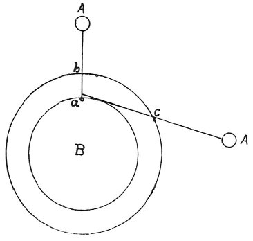

  
[Intangible Textual Heritage](../../index)  [Age of Reason](../index.md) 
[Index](index.md)   
[XV. Astronomy Index](dvs018.md)  
  [Previous](0888)  [Next](0890.md) 

------------------------------------------------------------------------

[Buy this Book at
Amazon.com](https://www.amazon.com/exec/obidos/ASIN/0486225739/internetsacredte.md)

------------------------------------------------------------------------

*The Da Vinci Notebooks at Intangible Textual Heritage*

### 889.

### WHY THE SUN APPEARS LARGER WHEN SETTING THAN AT NOON, WHEN IT IS NEAR TO US.

 

Every object seen through a curved medium seems to be of larger size
than it is.

 [464](#fn_130.md)

------------------------------------------------------------------------

### Footnotes

[153:464](0889.htm#fr_130.md) : At A is written
*sole* (the sun), at B *terra* (the earth).

------------------------------------------------------------------------

[Next: 890.](0890.md)
