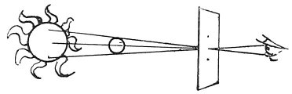

  
[Intangible Textual Heritage](../../index)  [Age of Reason](../index.md) 
[Index](index.md)   
[XV. Astronomy Index](dvs018.md)  
  [Previous](0890)  [Next](0892.md) 

------------------------------------------------------------------------

[Buy this Book at
Amazon.com](https://www.amazon.com/exec/obidos/ASIN/0486225739/internetsacredte.md)

------------------------------------------------------------------------

*The Da Vinci Notebooks at Intangible Textual Heritage*

### 891.

### A METHOD OF SEEING THE SUN ECLIPSED WITHOUT PAIN TO THE EYE.

 

Take a piece of paper and pierce holes in it with a needle, and look at
the sun through these holes.

------------------------------------------------------------------------

[Next: 892.](0892.md)
