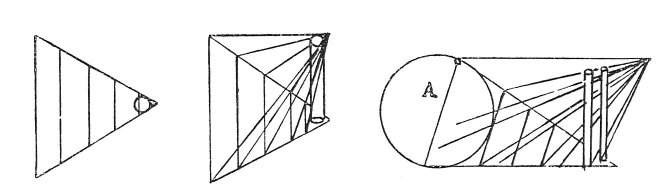

  
[Intangible Textual Heritage](../../index)  [Age of Reason](../index.md) 
[Index](index.md)   
[XV. Astronomy Index](dvs018.md)  
  [Previous](0891)  [Next](0893.md) 

------------------------------------------------------------------------

[Buy this Book at
Amazon.com](https://www.amazon.com/exec/obidos/ASIN/0486225739/internetsacredte.md)

------------------------------------------------------------------------

*The Da Vinci Notebooks at Intangible Textual Heritage*

### 892.

p. 154

### III.

### THE MOON.

### OF THE MOON.

 On the luminousity of the moon
(892-901).As I propose to treat of the nature of the moon, it is
necessary that first I should describe the perspective of mirrors,
whether plane, concave or convex; and first what is meant by a luminous
ray, and how it is refracted by various kinds of media; then, when a
reflected ray is most powerful, whether

 

when the angle of incidence is acute, right, or obtuse, or from a
convex, a plane, or a concave surface; or from an opaque or a
transparent body. Besides this, how it is that the solar rays which fall
on the waves of the sea, are seen by the eye of the same

p. 155

width at the angle nearest to the eye, as at the highest line of the
waves on the horizon; but notwithstanding this the solar rays reflected
from the waves of the sea assume the pyramidal form and consequently, at
each degree of distance increase proportionally in size, although to our
sight, they appear as parallel.

1st. Nothing that has very little weight is opaque.

2dly. Nothing that is excessively weighty can remain beneath
that which is heavier.

3dly. As to whether the moon is situated in the centre of its
elements or not.

And, if it has no proper place of its own, like the earth, in the midst
of its elements, why does it not fall to the centre of our elements?
 [465](#fn_131.md)

And, if the moon is not in the centre of its own elements and yet does
not fall, it must then be lighter than any other element.

And, if the moon is lighter than the other elements why is it opaque and
not transparent?

When objects of various sizes, being placed at various distances, look
of equal size, there must be the same relative proportion in the
distances as in the magnitudes of the objects.

 [466](#fn_132.md)

------------------------------------------------------------------------

### Footnotes

[155:465](0892.htm#fr_131.md) 26: The problem here
propounded by Leonardo was not satisfactorily answered till Newton in
1682 formulated the law of universal attraction and gravitation. Compare
No. 902, lines 5-15.

[155:466](0892.htm#fr_132.md) : In the diagram
Leonardo wrote *sole* at the place marked *A*.

------------------------------------------------------------------------

[Next: 893.](0893.md)
