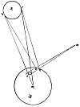

  
[Intangible Textual Heritage](../../index)  [Age of Reason](../index.md) 
[Index](index.md)   
[XV. Astronomy Index](dvs018.md)  
  [Previous](0894)  [Next](0896.md) 

------------------------------------------------------------------------

[Buy this Book at
Amazon.com](https://www.amazon.com/exec/obidos/ASIN/0486225739/internetsacredte.md)

------------------------------------------------------------------------

*The Da Vinci Notebooks at Intangible Textual Heritage*

### 895.

[  
Click to enlarge](img/v215600.jpg.md)

Either the moon has intrinsic luminosity or not. If it has, why does it
not shine without the aid of the sun? But if it has not any light in
itself it must of necessity be a spherical mirror; and if it is a
mirror, is it not proved in Perspective that the image of a luminous
object will never be equal to the extent of surface of the reflecting
body that it illuminates? And if it be thus  [468](#fn_134.md) , as is here shown at *r s* in the
figure, whence comes so great an extent of radiance as that of the full
moon as we see it, at the fifteenth day of the moon?

------------------------------------------------------------------------

### Footnotes

[156:468](0895.htm#fr_134.md) 13: At A, in the
diagram, Leonardo wrote "*sole*" (the sun), and at B "*luna o noi
terra*" (the moon or our earth). Compare also the text of No. 876.

------------------------------------------------------------------------

[Next: 896.](0896.md)
