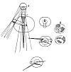

  
[Intangible Textual Heritage](../../index)  [Age of Reason](../index.md) 
[Index](index.md)   
[XV. Astronomy Index](dvs018.md)  
  [Previous](0896)  [Next](0898.md) 

------------------------------------------------------------------------

[Buy this Book at
Amazon.com](https://www.amazon.com/exec/obidos/ASIN/0486225739/internetsacredte.md)

------------------------------------------------------------------------

*The Da Vinci Notebooks at Intangible Textual Heritage*

### 897.

That the sun could not be mirrored in the body of the moon, which is a
convex mirror,

[  
Click to enlarge](img/v215900.jpg.md)

p. 160

in such a way as that so much of its surface as is illuminated by the
sun, should reflect the sun unless the moon had a surface adapted to
reflect it--in waves and ridges, like the surface of the sea when its
surface is moved by the wind.

 [470](#fn_136.md)

The waves in water multiply the image of the object reflected in it.

These waves reflect light, each by its own line, as the surface of the
fir cone does  [471](#fn_137.md)

These are 2 figures one different from the other; one with undulating
water and the other with smooth water.

It is impossible that at any distance the image of the sun cast on the
surface of a spherical body should occupy the half of the sphere.

Here you must prove that the earth produces all the same effects with
regard to the moon, as the moon with regard to the earth.

The moon, with its reflected light, does not shine like the sun, because
the light of the moon is not a continuous reflection of that of the sun
on its whole surface, but only on the crests and hollows of the waves of
its waters; and thus the sun being confusedly reflected, from the
admixture of the shadows that lie between the lustrous waves, its light
is not pure and clear as the sun is.

 [472](#fn_138.md) . The earth between the moon on
the fifteenth day and the sun.  [473](#fn_139.md)
Here the sun is in the East and the moon on the fifteenth day in the
West.  [474](#fn_140.md) The moon on the fifteenth
\[day\] between the earth and the sun. \[41\]Here it is the moon which
has the sun to the West and the earth to the East.

------------------------------------------------------------------------

### Footnotes

[160:470](0897.htm#fr_136.md) : In the original
diagrams *sole* is written at the place marked *A; luna* at *C,* and
*terra* at the two spots marked *B*.

[160:471](0897.htm#fr_137.md) 14: See the diagram
p. 145.

[160:472](0897.htm#fr_138.md) 38: This refers to
the small diagram placed between *B* and *B*.--

[160:473](0897.htm#fr_139.md) 39: See the diagram
below the one referred to in the preceding note.

[160:474](0897.htm#fr_140.md) 40.41: Refers to the
diagram below the others.

------------------------------------------------------------------------

[Next: 898.](0898.md)
