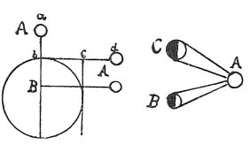
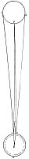

  
[Intangible Textual Heritage](../../index)  [Age of Reason](../index) 
[Index](index)   
[XV. Astronomy Index](dvs018)  
  [Previous](0897)  [Next](0899) 

------------------------------------------------------------------------

[Buy this Book at
Amazon.com](https://www.amazon.com/exec/obidos/ASIN/0486225739/internetsacredte)

------------------------------------------------------------------------

*The Da Vinci Notebooks at Intangible Textual Heritage*

### 898.

### WHAT SORT OF THING THE MOON IS.

The moon is not of itself luminous, but is highly fitted to assimilate
the character of light after the manner of a mirror, or of water, or of
any other reflecting body; and it grows larger in the East and in the
West, like the sun and the other planets. And the reason is that every
luminous body looks

p. 161

 

[  
Click to enlarge](img/v216101.jpg)

larger in proportion as it is remote. It is easy to understand that
every planet and star is farther from us when in the West than when it
is overhead, by about 3500 miles, as is proved on the margin  [475](#fn_141) , and if you see the sun or moon
mirrored in the water near to you, it looks to you of the same size in
the water as in the sky. But if you recede to the distance of a mile, it
will look 100 times larger; and if you see the sun reflected in the sea
at sunset, its image would look to you more than 10 miles long; because
that reflected image extends over more than 10 miles of sea. And if you
could stand where the moon is, the sun would look to you, as if it were
reflected from all the sea that it illuminates by day; and the land amid
the water would appear just like the dark spots that are on the moon,
which, when looked at from our earth, appears to men the same as our
earth would appear to any men who might dwell in the moon.

 [476](#fn_142)

### OF THE NATURE OF THE MOON.

When the moon is entirely lighted up to our sight, we see its full
daylight; and at that time, owing to the reflection of the solar rays
which fall on it and are thrown off towards us, its ocean casts off less
moisture towards us; and the less light it gives the more injurious it
is.

------------------------------------------------------------------------

### Footnotes

[161:475](0898.htm#fr_141) 7: refers to the
first diagram.--A = *sole* (the sun), B = *terra* (the earth), C =
*luna* (the moon).

[161:476](0898.htm#fr_142) : This text has
already been published by LIBRI: *Histoire des Sciences,* III, pp. 224,
225.

------------------------------------------------------------------------

[Next: 899.](0899)
