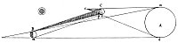

  
[Intangible Textual Heritage](../../index)  [Age of Reason](../index.md) 
[Index](index.md)   
[XV. Astronomy Index](dvs018.md)  
  [Previous](0901)  [Next](0903.md) 

------------------------------------------------------------------------

[Buy this Book at
Amazon.com](https://www.amazon.com/exec/obidos/ASIN/0486225739/internetsacredte.md)

------------------------------------------------------------------------

*The Da Vinci Notebooks at Intangible Textual Heritage*

### 902.

### OF THE MOON.

No solid body is less heavy than the atmosphere.

 [479](#fn_145.md)

 Explanation of the lumen cinereum in the
moon.Having proved that the part of the moon that shines consists
of water, which mirrors the body of the sun and reflects the radiance it
receives from it; and that, if these waters were devoid of waves, it
would appear small, but of a radiance almost like the sun; --\[5\] It
must now be shown whether the moon is a heavy or a light body: for, if
it were a heavy body--admitting that at every grade of distance from the
earth greater levity must prevail, so that water is lighter than the
earth, and air than water, and fire than air and so on successively--it
would seem that if the moon had density as it really has, it would have
weight, and having weight, that it could not be sustained in the space

p. 163

[  
Click to enlarge](img/v216300.jpg.md)

where it is, and consequently that it would fall towards the centre of
the universe and become united to the earth; or if not the moon itself,
at least its waters would fall away and be lost from it, and descend
towards the centre, leaving the moon without any and so devoid of
lustre. But as this does not happen, as might in reason be expected, it
is a manifest sign that the moon is surrounded by its own elements: that
is to say water, air and fire; and thus is, of itself and by itself,
suspended in that part of space, as our earth with its element is in
this part of space; and that heavy bodies act in the midst of its
elements just as other heavy bodies do in ours  [480](#fn_146.md)

When the eye is in the East and sees the moon in the West near to the
setting sun, it sees it with its shaded portion surrounded by luminous
portions; and the lateral and upper portion of this light is derived
from the sun, and the lower portion from the ocean in the West, which
receives the solar rays and reflects them on the lower waters of the
moon, and indeed affords the part of the moon that is in shadow as much
radiance as the moon gives the earth at midnight. Therefore it is not
totally dark, and hence some have believed that the moon must in parts
have a light of its own besides that which is given it by the sun; and
this light is due, as has been said, to the above- mentioned
cause,--that our seas are illuminated by the sun.

Again, it might be said that the circle of radiance

p. 164

 

shown by the moon when it and the sun are both in the West is wholly
borrowed from the sun, when it, and the sun, and the eye are situated as
is shown above.

 [481](#fn_147.md)

Some might say that the air surrounding the moon as an element, catches
the light of the sun as our atmosphere does, and that it is this which
completes the luminous circle on the body of the moon.

Some have thought that the moon has a light of its own, but this opinion
is false, because they have founded it on that dim light seen between
the hornes of the new moon, which looks dark where it is close to the
bright part, while against the darkness of the background it looks so
light that many have taken it to be a ring of new radiance completing
the circle where the tips of the horns illuminated by the sun cease to
shine  [482](#fn_148.md) . And this difference of
background arises from the fact that the portion of that background
which is conterminous with the bright part of the moon, by comparison
with that brightness looks darker than it is; while at the upper part,
where a portion of the luminous circle is to be seen of uniform width,
the result is that the moon, being brighter there than the medium or
background on which it is seen by comparison with that darkness it looks
more luminous at that edge than it is. And that brightness at such a
time itself is derived from our ocean and other inland-seas. These are,
at that time, illuminated by the sun which is already setting in such a
way as that the sea then fulfils the same function to the dark side of
the moon as the moon at its fifteenth day does to us when the

p. 165

sun is set. And the small amount of light which the dark side of the
moon receives bears the same proportion to the light of that side which
is illuminated, as that...  [483](#fn_149.md) .

If you want to see how much brighter the shaded portion of the moon is
than the background on which it is seen, conceal the luminous portion of
the moon with your hand or with some other more distant object.

------------------------------------------------------------------------

### Footnotes

[162:479](0902.htm#fr_145.md) : 1. On the margin
are the words *tola romantina, tola--ferro stagnato* (tinned iron);
*romantina* is some special kind of sheet-iron no longer known by that
name.

[163:480](0902.htm#fr_146.md) 15: This passage
would certainly seem to establish Leonardo's claim to be regarded as the
original discoverer of the cause of the ashy colour of the new moon
(*lumen cinereum*). His observations however, having hitherto remained
unknown to astronomers, Moestlin and Kepler have been credited with the
discoveries which they made independently a century later.

Some disconnected notes treat of the same subject in MS. C. A. 239b;
718b and 719b; "*Perche la luna cinta della parte alluminata dal sole in
ponente, tra maggior splendore in mezzo a tal cerchio, che quando essa
eclissava il sole. Questo accade perche nell' eclissare il sole ella
ombrava il nostro oceano, il qual caso non accade essendo in ponente,
quando il sole alluma esso oceano*." The editors of the "*Saggio*" who
first published this passage (page 12) add another short one about the
seasons in the moon which I confess not to have seen in the original
manuscript: "*La luna ha ogni mese un verno e una state, e ha maggiori
freddi e maggiori caldi, e i suoi equinozii son piu freddi de' nostri.*"

[164:481](0902.htm#fr_147.md) 23. 24: The larger
of the two diagrams reproduced above stands between these two lines, and
the smaller one is sketched in the margin. At the spot marked *A*
Leonardo wrote *corpo solare* (solar body) in the larger diagram and
*Sole* (sun) in the smaller one. At *C luna* (moon) is written and at *B
terra* (the earth).

[164:482](0902.htm#fr_148.md) 34: See [Pl.
CVIII](pl108.htm#img_pl108.md), No. 5.

[165:483](0902.htm#fr_149.md) 42: Here the text
breaks off; lines 43-52 are written on the margin.

------------------------------------------------------------------------

[Next: 903.](0903.md)
