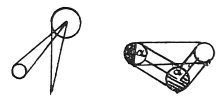

  
[Intangible Textual Heritage](../../index)  [Age of Reason](../index.md) 
[Index](index.md)   
[XV. Astronomy Index](dvs018.md)  
  [Previous](0904)  [Next](0906.md) 

------------------------------------------------------------------------

[Buy this Book at
Amazon.com](https://www.amazon.com/exec/obidos/ASIN/0486225739/internetsacredte.md)

------------------------------------------------------------------------

*The Da Vinci Notebooks at Intangible Textual Heritage*

### 905.

### OF THE SPOTS ON THE MOON.

It has been asserted, that the spots on the moon result from the moon
being of varying thinness or density; but if this were so, when there is
an eclipse of the moon the solar rays would pierce through the portions
which were thin as is alleged  [484](#fn_150.md) .
But as we do not see this effect the opinion must be false.

 

Others say that the surface of the moon is smooth and polished and that,
like a mirror, it reflects in itself the image of our earth. This view
is also false, inasmuch as the land, where it is not covered with water,
presents various aspects and forms. Hence when the moon is in the East
it would reflect different spots from those it would show when it is
above us or in the West; now the spots on the moon, as they are seen at
full moon, never vary in the course of its motion over our hemisphere. A
second reason is that an object reflected in a convex body takes up but
a small portion of that body, as is proved in perspective  [485](#fn_151.md) . The third reason is that when the
moon is full, it only faces half the hemisphere of the

p. 167

illuminated earth, on which only the ocean and other waters reflect
bright light, while the land makes spots on that brightness; thus half
of our earth would be seen girt round with the brightness of the sea
lighted up by the sun, and in the moon this reflection would be the
smallest part of that moon. Fourthly, a radiant body cannot be reflected
from another equally radiant; therefore the sea, since it borrows its
brightness from the sun,--as the moon does--, could not cause the earth
to be reflected in it, nor indeed could the body of the sun be seen
reflected in it, nor indeed any star opposite to it.

------------------------------------------------------------------------

### Footnotes

[166:484](0905.htm#fr_150.md) 3-5: *Eclissi*. This
word, as it seems to me, here means eclipses of the sun; and the sense
of the passage, as I understand it, is that by the foregoing hypothesis
the moon, when it comes between the sun and the earth must appear as if
pierced,--we may say like a sieve.

[166:485](0905.htm#fr_151.md) 18: *come e
provato*. This alludes to the accompanying diagram.

------------------------------------------------------------------------

[Next: 906.](0906.md)
