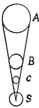

  
[Intangible Textual Heritage](../../index)  [Age of Reason](../index.md) 
[Index](index.md)   
[XV. Astronomy Index](dvs018.md)  
  [Previous](0911)  [Next](0913.md) 

------------------------------------------------------------------------

[Buy this Book at
Amazon.com](https://www.amazon.com/exec/obidos/ASIN/0486225739/internetsacredte.md)

------------------------------------------------------------------------

*The Da Vinci Notebooks at Intangible Textual Heritage*

### 912.

### WHETHER THE STARS HAVE THEIR LIGHT FROM THE SUN OR IN THEMSELVES.

Some say that they shine of themselves, alledging that if Venus and
Mercury had not a light of their own, when they come between our eye and
the sun they would darken so much of the sun as they could cover from
our eye. But this is false, for it is proved that a dark object against
a luminous body is enveloped and entirely concealed by the lateral rays
of the rest of that luminous body and so remains invisible. As may be
seen  [488](#fn_154.md)

p. 170

when the sun is seen through the boughs of trees bare of their leaves,
at some distance the branches do not conceal any portion of the sun from
our eye. The same thing happens with the above mentioned planets which,
though they have no light of their own, do not--as has been
said--conceal any part of the sun from our eye \[18\].

### SECOND ARGUMENT.

 

Some say that the stars appear most brilliant at night in proportion as
they are higher up; and that if they had no light of their own, the
shadow of the earth which comes between them and the sun, would darken
them, since they would not face nor be faced by the solar body. But
those persons have not considered that the conical shadow of the earth
cannot reach many of the stars; and even as to those it does reach, the
cone is so much diminished that it covers very little of the star's
mass, and all the rest is illuminated by the sun.

------------------------------------------------------------------------

### Footnotes

[169:488](0912.htm#fr_154.md) : 912: From this and
other remarks (see No. 902, l. 34 &c) it is clear that Leonardo was
familiar with the phenomena of Irradiation.

------------------------------------------------------------------------

[Next: 913.](0913.md)
