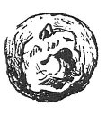

  
[Intangible Textual Heritage](../../index)  [Age of Reason](../index) 
[Index](index)   
[XVI. Physical Geography Index](dvs019)  
  [Previous](0936)  [Next](0938) 

------------------------------------------------------------------------

[Buy this Book at
Amazon.com](https://www.amazon.com/exec/obidos/ASIN/0486225739/internetsacredte)

------------------------------------------------------------------------

*The Da Vinci Notebooks at Intangible Textual Heritage*

### 937.

### WHETHER THE EARTH IS LESS THAN THE WATER.

 

 Of the proportion of the mass of water to that
of the earth (937. 938).Some assert that it is true that the
earth, which is not covered by water is much less than that covered by
water. But considering the size of 7000 miles in diameter which is that
of this earth, we may conclude the water to be of small depth.

------------------------------------------------------------------------

[Next: 938.](0938)
