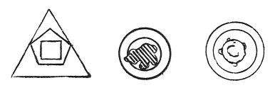

  
[Intangible Textual Heritage](../../index)  [Age of Reason](../index.md) 
[Index](index.md)   
[XVI. Physical Geography Index](dvs019.md)  
  [Previous](0938)  [Next](0940.md) 

------------------------------------------------------------------------

[Buy this Book at
Amazon.com](https://www.amazon.com/exec/obidos/ASIN/0486225739/internetsacredte.md)

------------------------------------------------------------------------

*The Da Vinci Notebooks at Intangible Textual Heritage*

### 939.

### THE FIGURES OF THE ELEMENTS.

 

 The theory of Plato.Of the figures of the
elements; and first as against those who deny the opinions of Plato, and
who say that if the elements include one another in the forms attributed
to them by Plato they would cause a vacuum one within the other. I say
it is not true, and I here prove it, but first I desire to propound some
conclusions. It is not necessary that the elements which include each
other should be of corresponding magnitude in all the parts, of that
which includes and of that which is included. We see that the sphere of
the waters varies conspicuously in mass from the surface to the bottom,
and that, far from investing the earth when that was in the form of a
cube that is of 8 angles as Plato will have it, that it invests the
earth which has innumerable angles of rock covered by the water and
various prominences and concavities, and yet no vacuum is generated
between the earth and water; again, the air invests the sphere of waters
together with the mountains and valleys, which rise above that sphere,
and no vacuum remains between the earth and the air, so that any one who
says a vacuum is generated, speaks foolishly.

But to Plato I would reply that the surface of the figures which
according to him the elements would have, could not exist.

That the flow of rivers proves the slope of the land.

------------------------------------------------------------------------

[Next: 940.](0940.md)
