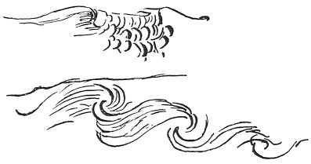

  
[Intangible Textual Heritage](../../index)  [Age of Reason](../index.md) 
[Index](index.md)   
[XVI. Physical Geography Index](dvs019.md)  
  [Previous](0951)  [Next](0953.md) 

------------------------------------------------------------------------

[Buy this Book at
Amazon.com](https://www.amazon.com/exec/obidos/ASIN/0486225739/internetsacredte.md)

------------------------------------------------------------------------

*The Da Vinci Notebooks at Intangible Textual Heritage*

### 952.

### OF WAVES.

 

 On the encroachments of the sea on the land and
vice versa (952-954).A wave of the sea always breaks in front of
its base, and that portion of the crest will then be lowest which before
was highest.

 [502](#fn_168.md)

------------------------------------------------------------------------

### Footnotes

[191:502](0952.htm#fr_168.md) : The page of
FRANCESCO DI GIORGIO'S *Trattato*, on which Leonardo has written this
remark, contains some notes on the construction of dams, harbours &c

------------------------------------------------------------------------

[Next: 953.](0953.md)
