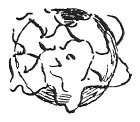

  
[Intangible Textual Heritage](../../index)  [Age of Reason](../index.md) 
[Index](index.md)   
[XVI. Physical Geography Index](dvs019.md)  
  [Previous](0961)  [Next](0963.md) 

------------------------------------------------------------------------

[Buy this Book at
Amazon.com](https://www.amazon.com/exec/obidos/ASIN/0486225739/internetsacredte.md)

------------------------------------------------------------------------

*The Da Vinci Notebooks at Intangible Textual Heritage*

### 962.

 

This is meant to represent the earth cut through in the middle, showing
the depths of the sea and of the earth; the waters start from the bottom
of the seas, and ramifying through the earth they rise to the summits of
the mountains, flowing back by the rivers and returning to the sea.

------------------------------------------------------------------------

[Next: 963.](0963.md)
