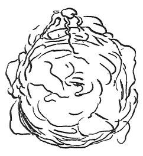

  
[Intangible Textual Heritage](../../index)  [Age of Reason](../index.md) 
[Index](index.md)   
[XVI. Physical Geography Index](dvs019.md)  
  [Previous](0964)  [Next](0966.md) 

------------------------------------------------------------------------

[Buy this Book at
Amazon.com](https://www.amazon.com/exec/obidos/ASIN/0486225739/internetsacredte.md)

------------------------------------------------------------------------

*The Da Vinci Notebooks at Intangible Textual Heritage*

### 965.

 

It is the property of water that it constitutes the vital human of this
arid earth; and the cause which moves it through its ramified veins,
against the natural course of heavy matters, is the same property which
moves the humours in every species of animal body. But that which crowns
our wonder in contemplating it is, that it rises from the utmost depths
of the sea to the highest tops of the mountains, and flowing from the
opened veins returns to the low seas; then once more, and with extreme
swiftness, it mounts again and returns by the same descent, thus rising
from the inside to the outside, and going round from the lowest to the
highest, from whence it rushes down in a natural course. Thus by these
two movements combined in a constant circulation, it travels through the
veins of the earth.

------------------------------------------------------------------------

[Next: 966.](0966.md)
