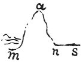

  
[Intangible Textual Heritage](../../index)  [Age of Reason](../index.md) 
[Index](index.md)   
[XVI. Physical Geography Index](dvs019.md)  
  [Previous](0965)  [Next](0967.md) 

------------------------------------------------------------------------

[Buy this Book at
Amazon.com](https://www.amazon.com/exec/obidos/ASIN/0486225739/internetsacredte.md)

------------------------------------------------------------------------

*The Da Vinci Notebooks at Intangible Textual Heritage*

### 966.

### WHETHER WATER RISES FROM THE SEA TO THE TOPS OF MOUNTAINS.

The water of the ocean cannot make its way from the bases to the tops of
the mountains

p. 198

 

which bound it, but only so much rises as the dryness of the mountain
attracts. And if, on the contrary, the rain, which penetrates from the
summit of the mountain to the base, which is the boundary of the sea,
descends and softens the slope opposite to the said mountain and
constantly draws the water, like a syphon  [508](#fn_174.md) which pours through its longest side,
it must be this which draws up the water of the sea; thus if *s n* were
the surface of the sea, and the rain descends from the top of the
mountain *a* to *n* on one side, and on the other sides it descends from
*a* to *m*, without a doubt this would occur after the manner of
distilling through felt, or as happens through the tubes called syphons
 [509](#fn_175.md) . And at all times the water
which has softened the mountain, by the great rain which runs down the
two opposite sides, would constantly attract the rain *a n*, on its
longest side together with the water from the sea, if that side of the
mountain *a m* were longer than the other *a n*; but this cannot be,
because no part of the earth which is not submerged by the ocean can be
lower than that ocean.

------------------------------------------------------------------------

### Footnotes

[198:508](0966.htm#fr_174.md) 11: Cicognola,
Syphon. See Vol. I, [Pl. XXIV](dv20951.htm#img_pl024.md), No. 1.

[198:509](0966.htm#fr_175.md) 17: Cicognola,
Syphon. See Vol. I, [Pl. XXIV](dv20951.htm#img_pl024.md), No. 1.

------------------------------------------------------------------------

[Next: 967.](0967.md)
