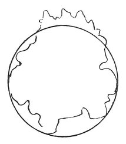

  
[Intangible Textual Heritage](../../index)  [Age of Reason](../index.md) 
[Index](index.md)   
[XVI. Physical Geography Index](dvs019.md)  
  [Previous](0980)  [Next](0982.md) 

------------------------------------------------------------------------

[Buy this Book at
Amazon.com](https://www.amazon.com/exec/obidos/ASIN/0486225739/internetsacredte.md)

------------------------------------------------------------------------

*The Da Vinci Notebooks at Intangible Textual Heritage*

### 981.

 

The summits of mountains for a long time rise constantly.

The opposite sides of the mountains always approach each other below;
the depths of the valleys which are above the sphere of the waters are
in the course of time constantly getting nearer to the centre of the
world.

In an equal period, the valleys sink much more than the mountains rise.

The bases of the mountains always come closer together.

In proportion as the valleys become deeper, the more quickly are their
sides worn away.

------------------------------------------------------------------------

[Next: 982.](0982.md)
