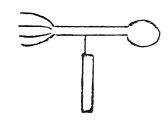

  
[Intangible Textual Heritage](../../index)  [Age of Reason](../index.md) 
[Index](index.md)   
[XVI. Physical Geography Index](dvs019.md)  
  [Previous](0998)  [Next](1000.md) 

------------------------------------------------------------------------

[Buy this Book at
Amazon.com](https://www.amazon.com/exec/obidos/ASIN/0486225739/internetsacredte.md)

------------------------------------------------------------------------

*The Da Vinci Notebooks at Intangible Textual Heritage*

### 999.

 

To know better the direction of the winds.  [531](#fn_197.md)

------------------------------------------------------------------------

### Footnotes

[220:531](0999.htm#fr_197.md) : In connection with
this text I may here mention a hygrometer, drawn and probably invented
by Leonardo. A facsimile of this is given in Vol. I, p. 297 with the
note: *'Modi di pesare l'arie eddi sapere quando s'a arrompere il tepo'*
(Mode of weighing the air and of knowing when the weather will change);
by the sponge *"Spugnea"* is written.

------------------------------------------------------------------------

[Next: 1000.](1000.md)
