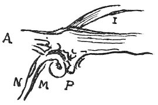

  
[Intangible Textual Heritage](../../index)  [Age of Reason](../index.md) 
[Index](index.md)   
[XVII. Topographical Notes Index](dvs020.md)  
  [Previous](1006)  [Next](1008.md) 

------------------------------------------------------------------------

[Buy this Book at
Amazon.com](https://www.amazon.com/exec/obidos/ASIN/0486225739/internetsacredte.md)

------------------------------------------------------------------------

*The Da Vinci Notebooks at Intangible Textual Heritage*

### 1007.

 

The eddy made by the Mensola, when the Arno is low and the Mensola full.

 [537](#fn_203.md)

------------------------------------------------------------------------

### Footnotes

[229:537](1007.htm#fr_203.md) : *Mensola* is a
mountain stream which falls into the Arno about a mile and a half above
Florence.

A=Arno, I=Isola, M=Mvgone, P=Pesa, N=Mesola.

------------------------------------------------------------------------

[Next: 1008.](1008.md)
