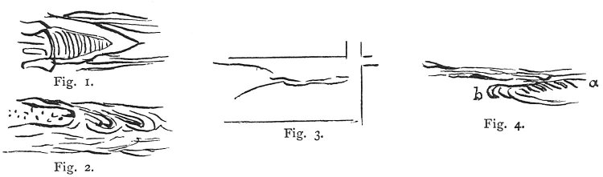

  
[Intangible Textual Heritage](../../index)  [Age of Reason](../index) 
[Index](index)   
[XVII. Topographical Notes Index](dvs020)  
  [Previous](1007)  [Next](1009) 

------------------------------------------------------------------------

[Buy this Book at
Amazon.com](https://www.amazon.com/exec/obidos/ASIN/0486225739/internetsacredte)

------------------------------------------------------------------------

*The Da Vinci Notebooks at Intangible Textual Heritage*

### 1008.

p. 230

That the river which is to be turned from one place to another must be
coaxed and not treated roughly or with violence; and to do this a sort
of floodgate should be made in the river, and then lower down one in
front of it and in like manner a third, fourth and fifth, so that the
river may discharge itself into the channel given to it, or that by this
means it may be diverted from the place it has damaged, as was done in
Flanders--as I was told by Niccolo di Forsore.

How to protect and repair the banks washed by the water, as below the
island of Cocomeri.

 

Ponte Rubaconte (Fig. 1); below \[the palaces\] Bisticci and Canigiani
(Fig. 2). Above the flood gate of la Giustizia (Fig. 3); *a b* is a sand
bank opposite the end of the island of the Cocomeri in the middle of the
Arno (Fig. 4).  [538](#fn_204)

------------------------------------------------------------------------

### Footnotes

[230:538](1008.htm#fr_204) : The course of the
river Arno is also discussed in Nos. 987 and 988.

------------------------------------------------------------------------

[Next: 1009.](1009)
