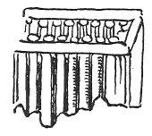
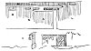

  
[Intangible Textual Heritage](../../index)  [Age of Reason](../index) 
[Index](index)   
[XVII. Topographical Notes Index](dvs020)  
  [Previous](1011)  [Next](1013) 

------------------------------------------------------------------------

[Buy this Book at
Amazon.com](https://www.amazon.com/exec/obidos/ASIN/0486225739/internetsacredte)

------------------------------------------------------------------------

*The Da Vinci Notebooks at Intangible Textual Heritage*

### 1012.

 

From the beginning of the canal to the mill.

From the beginning of the canal of Brivio to the mill of Travaglia is
2794 trabochi, that is 11176 braccia, which is more than 3 miles and two
thirds; and here the canal is 57 braccia higher than the surface

[  
Click to enlarge](img/v223101.jpg)

p. 232

of the water of the Adda, giving a fall of two inches in every hundred
trabochi; and at that spot we propose to take the opening of our canal.

 

 [541](#fn_207)

------------------------------------------------------------------------

### Footnotes

[232:541](1012.htm#fr_207) : The following are
written on the sketches: At the place marked *N: navilio da dacquiue*
(canal of running water); at *M: molin del Travaglia* (Mill of
Travaglia); at *R: rochetta ssanta maria* (small rock of Santa Maria);
at *A: Adda;* at *L: Lagho di Lecho ringorgato alli 3 corni in
Adda,--Concha perpetua* (lake of Lecco overflowing at Tre Corni, in
Adda,-- a permanent sluice). Near the second sketch, referring to the
sluice near *Q: qui la chatena ttalie d'u peso* (here the chain is in
one piece). At *M* in the lower sketch: *mol del travaglia, nel cavare
la concha il tereno ara chotrapero co cassa d'acqua.* (Mill of
Travaglia, in digging out the sluice the soil will have as a
counterpoise a vessel of water).

------------------------------------------------------------------------

[Next: 1013.](1013)
