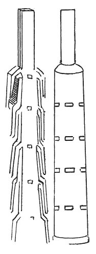

  
[Intangible Textual Heritage](../../index)  [Age of Reason](../index) 
[Index](index)   
[XVII. Topographical Notes Index](dvs020)  
  [Previous](1022)  [Next](1024) 

------------------------------------------------------------------------

[Buy this Book at
Amazon.com](https://www.amazon.com/exec/obidos/ASIN/0486225739/internetsacredte)

------------------------------------------------------------------------

*The Da Vinci Notebooks at Intangible Textual Heritage*

### 1023.

 Note on Pavia.The chimneys of the castle
of Pavia have 6 rows of openings and from each to the other is one
braccio.

 

 [549](#fn_215)

------------------------------------------------------------------------

### Footnotes

[235:549](1023.htm#fr_215) : Other notes
relating to Pavia occur on p. 43 and p. 53 ([Pl.
XCVIII](pl098.htm#img_pl098), No. 3). Compare No. 1448, 26.

------------------------------------------------------------------------

[Next: 1024.](1024)
