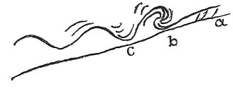

  
[Intangible Textual Heritage](../../index)  [Age of Reason](../index) 
[Index](index)   
[XVII. Topographical Notes Index](dvs020)  
  [Previous](1034)  [Next](1036) 

------------------------------------------------------------------------

[Buy this Book at
Amazon.com](https://www.amazon.com/exec/obidos/ASIN/0486225739/internetsacredte)

------------------------------------------------------------------------

*The Da Vinci Notebooks at Intangible Textual Heritage*

### 1035.

 

Made by the sea at Piombino.  [560](#fn_226)

------------------------------------------------------------------------

### Footnotes

[240:560](1035.htm#fr_226) : Below the sketch
there are eleven lines of text referring to the motion of waves.

------------------------------------------------------------------------

[Next: 1036.](1036)
