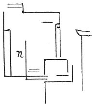

  
[Intangible Textual Heritage](../../index)  [Age of Reason](../index.md) 
[Index](index.md)   
[XVII. Topographical Notes Index](dvs020.md)  
  [Previous](1048)  [Next](1050.md) 

------------------------------------------------------------------------

[Buy this Book at
Amazon.com](https://www.amazon.com/exec/obidos/ASIN/0486225739/internetsacredte.md)

------------------------------------------------------------------------

*The Da Vinci Notebooks at Intangible Textual Heritage*

### 1049.

 

The fortress at Urbino.  [570](#fn_236.md)

------------------------------------------------------------------------

### Footnotes

[242:570](1049.htm#fr_236.md) : 1049. In the
original the text is written inside the sketch in the place here marked
*n*.

------------------------------------------------------------------------

[Next: 1050.](1050.md)
