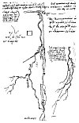

  
[Intangible Textual Heritage](../../index)  [Age of Reason](../index) 
[Index](index)   
[XVII. Topographical Notes Index](dvs020)  
  [Previous](1077)  [Next](1079) 

------------------------------------------------------------------------

[Buy this Book at
Amazon.com](https://www.amazon.com/exec/obidos/ASIN/0486225739/internetsacredte)

------------------------------------------------------------------------

*The Da Vinci Notebooks at Intangible Textual Heritage*

### 1078.

A trabocco is four braccia, and one mile is three thousand of the said
braccia. Each braccio is divided into 12 inches; and the water in the
canals has a fall in every hundred trabocchi of two of these inches;
therefore 14 inches of fall are necessary in two thousand eight hundred
braccia of flow in these canals; it follows that 15 inches of fall give
the required momentum to the currents of the waters in the said canals,
that is one braccio and a half in the mile. And from this it may be
concluded that the water taken from the river of Ville-franche

p. 254

[  
Click to enlarge](img/v225400.jpg)

p. 255

and lent to the river of Romorantin will..... Where one river by reason
of its low level cannot flow into the other, it will be necessary to dam
it up, so that it may acquire a fall into the other, which was
previously the higher.

The eve of Saint Antony I returned from Romorantin to Amboise, and the
King went away two days before from Romorantin.

From Romorantin as far as the bridge at Saudre it is called the Saudre,
and from that bridge as far as Tours it is called the Cher.

I would test the level of that channel which is to lead from the Loire
to Romorantin, with a channel one braccio wide and one braccio deep.

 [594](#fn_260)

------------------------------------------------------------------------

### Footnotes

[255:594](1078.htm#fr_260) : Lines 6-18 are
partly reproduced in the facsimile on p. 254, and the whole of lines
19-25.

The following names are written along the rivers on the larger sketch,
*era f* (the Loire) *scier f* (the Cher) three times. *Pote Sodro*
(bridge of the Soudre). *Villa francha* (Villefranche) *banco*
(sandbank) *Sodro* (Soudre). The circle below shows the position of
Romorantin. The words '*orologio del sole*' written below do not belong
to the map of the rivers. The following names are written by the side of
the smaller sketch-map:--*tors* (Tours), *Abosa* (Amboise) *bres*--for
Bles (Blois) *mo rica* (Montrichard). *Lione* (Lyons). This map was also
published in the 'Saggio' (Milano, 1872) [Pl.
XXII](dv20949.htm#img_pl022), and the editors remark: *Forse la linia
retta che va da Amboise a Romorantin segna l'andamento proposto d'un
Canale, che poi rembra prolungarsi in giu fin dove sta scritto Lione.*

M. Ravaisson has enlarged on this idea in the Gazette des Beaux Arts
(1881 p. 530): *Les traces de Leonard permettent d'entrevoir que le
canal commencant soit aupres de Tours, soit aupres de Blois et passant
par Romorantin, avec port d'embarquement a Villefranche, devait, au dela
de Bourges, traverser l'Allier au-dessous des affluents de la Dore et de
la Sioule, aller par Moulins jusqu' a Digoin; enfin, sur l'autre rive de
la Loire, depasser les monts du Charolais et rejoindre la Saone aupres
de Macon.* It seems to me rash, however, to found so elaborate an
hypothesis on these sketches of rivers. The slight stroke going to
*Lione* is perhaps only an indication of the direction.--With regard to
the Loire compare also No. 988. l. 38.

------------------------------------------------------------------------

[Next: 1079.](1079)
