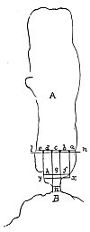

  
[Intangible Textual Heritage](../../index)  [Age of Reason](../index.md) 
[Index](index.md)   
[XVII. Topographical Notes Index](dvs020.md)  
  [Previous](1082)  [Next](1084.md) 

------------------------------------------------------------------------

[Buy this Book at
Amazon.com](https://www.amazon.com/exec/obidos/ASIN/0486225739/internetsacredte.md)

------------------------------------------------------------------------

*The Da Vinci Notebooks at Intangible Textual Heritage*

### 1083.

p. 258

### III.

### THE COUNTRIES OF THE WESTERN END OF THE MEDITERRANEAN.

### WHY THE SEA MAKES A STRONGER CURRENT IN THE STRAITS OF SPAIN THAN ELSEWHERE.

[  
Click to enlarge](img/v225800.jpg.md)

 The straits of Gibraltar (1083-1085).A
river of equal depth runs with greater speed in a narrow space than in a
wide one, in proportion to the difference between the wider and the
narrower one.

This proposition is clearly proved by reason confirmed by experiment.
Supposing that through a channel one mile wide there flows one mile in
length of water; where the river is five miles wide each of the 5 square
miles will require 1/5 of itself to be equal to the square mile of water
required in the sea, and where the river is 3 miles wide each of these
square miles will require the third of its volume to make up the amount
of the square mile of the narrow part; as is demonstrated in *f g h* at
the mile marked *n*.

 [600](#fn_266.md)

------------------------------------------------------------------------

### Footnotes

[258:600](1083.htm#fr_266.md) : In the place
marked A in the diagram *Mare Mediterano* (Mediterranean Sea) is written
in the original. And at B, *stretto di Spugna* (straits of Spain, *i.e.*
Gibraltar). Compare No. 960.

------------------------------------------------------------------------

[Next: 1084.](1084.md)
