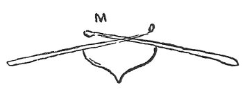
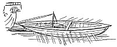
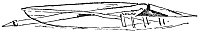
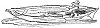

  
[Intangible Textual Heritage](../../index)  [Age of Reason](../index.md) 
[Index](index.md)   
[XVIII. Naval Warfare. Mechanical Appliances. Music. Index](dvs021.md)  
  [Previous](1115)  [Next](1117.md) 

------------------------------------------------------------------------

[Buy this Book at
Amazon.com](https://www.amazon.com/exec/obidos/ASIN/0486225739/internetsacredte.md)

------------------------------------------------------------------------

*The Da Vinci Notebooks at Intangible Textual Heritage*

### 1116.

p. 276

 

If you want to build an armada for the sea employ these ships to ram in
the enemy's ships. That is, make ships 100 feet long and 8 feet wide,
but arranged so that the left hand rowers may have their oars to the
right side of the ship, and the right hand ones to the left side, as is
shown at M, so that the leverage of the oars may be longer. And the

[  
Click to enlarge](img/v227601.jpg.md)

said ship may be one foot and a half thick, that is made with cross
beams within and without,

[  
Click to enlarge](img/v227602.jpg.md)

[  
Click to enlarge](img/v227603.jpg.md)

with planks in contrary directions. And this ship must have attached to
it, a foot below the

p. 277

water, an iron-shod spike of about the weight and size of an anvil; and
this, by force of oars may, after it has given the first blow, be drawn
back, and driven forward again with fury give a second blow, and then a
third, and so many as to destroy the other ship.

------------------------------------------------------------------------

[Next: 1117.](1117.md)
