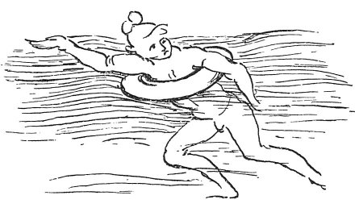

  
[Intangible Textual Heritage](../../index)  [Age of Reason](../index.md) 
[Index](index.md)   
[XVIII. Naval Warfare. Mechanical Appliances. Music. Index](dvs021.md)  
  [Previous](1116)  [Next](1118.md) 

------------------------------------------------------------------------

[Buy this Book at
Amazon.com](https://www.amazon.com/exec/obidos/ASIN/0486225739/internetsacredte.md)

------------------------------------------------------------------------

*The Da Vinci Notebooks at Intangible Textual Heritage*

### 1117.

### A METHOD OF ESCAPING IN A TEMPEST AND SHIPWRECK AT SEA.

 

 The use of swimming belts.Have a coat
made of leather, which must be double across the breast, that is having
a hem on each side of about a finger breadth. Thus it will be double
from the waist to the knee; and the leather must be quite air-tight.
When you want to leap into the sea, blow out the skirt of your coat
through the double hems of the breast; and jump into the sea, and allow
yourself to be carried by the waves; when you see no shore near, give
your attention to the sea you are in, and always keep in your mouth the
air-tube which leads down into the coat; and if now and again you
require to take a breath of fresh air, and the foam prevents you, you
may draw a breath of the air within the coat.

 [622](#fn_288.md)

------------------------------------------------------------------------

### Footnotes

[277:622](1117.htm#fr_288.md) : AMORETTI, *Memorie
Storiche*, Tav. II. B. Fig. 5, gives the same figure, somewhat altered.
6. *La canna dell' aria*. Compare Vol. I. No. I. Note

------------------------------------------------------------------------

[Next: 1118.](1118.md)
