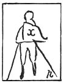

  
[Intangible Textual Heritage](../../index)  [Age of Reason](../index) 
[Index](index)   
[XVIII. Naval Warfare. Mechanical Appliances. Music. Index](dvs021)  
  [Previous](1121)  [Next](1123) 

------------------------------------------------------------------------

[Buy this Book at
Amazon.com](https://www.amazon.com/exec/obidos/ASIN/0486225739/internetsacredte)

------------------------------------------------------------------------

*The Da Vinci Notebooks at Intangible Textual Heritage*

### 1122.

 

 On Flying machines (1122-1126).Man when
flying must stand free from the waist upwards so as to be able to
balance himself as he does in a boat so that the centre of gravity in
himself and in the machine may counterbalance each other, and be shifted
as necessity demands for the changes of its centre of resistance.

------------------------------------------------------------------------

[Next: 1123.](1123)
