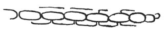

  
[Intangible Textual Heritage](../../index)  [Age of Reason](../index) 
[Index](index)   
[XVIII. Naval Warfare. Mechanical Appliances. Music. Index](dvs021)  
  [Previous](1124)  [Next](1126) 

------------------------------------------------------------------------

[Buy this Book at
Amazon.com](https://www.amazon.com/exec/obidos/ASIN/0486225739/internetsacredte)

------------------------------------------------------------------------

*The Da Vinci Notebooks at Intangible Textual Heritage*

### 1125.

 

Bags by which a man falling from a height of 6 braccia may avoid hurting
himself, by a fall whether into water or on the ground; and these bags,
strung together like a rosary, are to be fixed on one's back.

------------------------------------------------------------------------

[Next: 1126.](1126)
