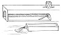

  
[Intangible Textual Heritage](../../index)  [Age of Reason](../index) 
[Index](index)   
[XVIII. Naval Warfare. Mechanical Appliances. Music. Index](dvs021)  
  [Previous](1126)  [Next](1128) 

------------------------------------------------------------------------

[Buy this Book at
Amazon.com](https://www.amazon.com/exec/obidos/ASIN/0486225739/internetsacredte)

------------------------------------------------------------------------

*The Da Vinci Notebooks at Intangible Textual Heritage*

### 1127.

p. 280

[  
Click to enlarge](img/v228000.jpg)

 Of mining.If you want to know where a
mine runs, place a drum over all the places where you suspect that it is
being made, and upon this drum put a couple of dice, and when you are
over the spot where they are mining, the dice will jump a little on the
drum at every blow which is given underground in the mining.

There are persons who, having the convenience of a river or a lake in
their lands, have made, close to the place where they suspect that a
mine is being made, a great reservoir of water, and have countermined
the enemy, and having found them, have turned the water upon them and
destroyed a great number in the mine.

------------------------------------------------------------------------

[Next: 1128.](1128)
