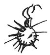

  
[Intangible Textual Heritage](../../index)  [Age of Reason](../index.md) 
[Index](index.md)   
[XVIII. Naval Warfare. Mechanical Appliances. Music. Index](dvs021.md)  
  [Previous](1127)  [Next](1129.md) 

------------------------------------------------------------------------

[Buy this Book at
Amazon.com](https://www.amazon.com/exec/obidos/ASIN/0486225739/internetsacredte.md)

------------------------------------------------------------------------

*The Da Vinci Notebooks at Intangible Textual Heritage*

### 1128.

### GREEK FIRE.

 Of Greek fire.Take charcoal of willow,
and saltpetre, and sulphuric acid, and sulphur, and pitch, with
frankincense and camphor, and Ethiopian wool, and boil them all
together. This

p. 281

fire is so ready to burn that it clings to the timbers even under water.
And add to this composition liquid varnish, and bituminous oil, and
turpentine and strong vinegar, and mix all together and dry it in the
sun, or in an oven when the bread is taken out; and then stick it round
hempen or other tow, moulding it into a round form, and studding it all
over with very sharp nails. You must leave in this ball an opening to
serve as a fusee, and cover it with rosin and sulphur.

 

Again, this fire, stuck at the top of a long plank which has one braccio
length of the end pointed with iron that it may not be burnt by the said
fire, is good for avoiding and keeping off the ships, so as not to be
overwhelmed by their onset.

Again throw vessels of glass full of pitch on to the enemy's ships when
the men in them are intent on the battle; and then by throwing similar
burning balls upon them you have it in your power to burn all their
ships.

 [628](#fn_294.md)

------------------------------------------------------------------------

### Footnotes

[281:628](1128.htm#fr_294.md) : Venturi has given
another short text about the Greek fire in a French translation (Essai
Section XIV). He adds that the original text is to be found in MS. B. 30
(?). Libri speaks of it in a note as follows (*Histoire des sciences
mathematiques en Italie Vol. II* p. 129): *La composition du feu
gregeois est une des chases qui ont ete les plus cherchees et qui sont
encore les plus douteuses. On dit qu'il fut invente au septieme siecle
de l'ere chretienne par l'architecte Callinique (Constantini
Porphyrogenetae opera, Lugd. Batav.* 1617,-- *in-*8vo; p. 172, *de
admin, imper. exp.* 48*), et il se trouve souvent mentionne par les
Historiens Byzantins. Tantot on le langait avec des machines, comme on
lancerait une banche, tantot on le soufflait avec de longs tubes, comme
on soufflerait un gaz ou un liquide enflamme (Annae Comnenae Alexias*,
p. 335, *lib. XI.--Aeliani et Leonis, imperatoris tactica, Lugd.-Bat.*
1613, *in*-4. part. 2 a, p. 322, *Leonis tact. cap.* l9.--*Joinville,
histoire du Saint Louis collect. Petitot tom. II,* p. 235). *Les
ecrivains contemporains disent que l'eau ne pouvait pas eteindre ce feu,
mais qu'avec du vinaigre et du sable on y parvenait. Suivant quelques
historiens le feu gregeois etait compose de soufre et de resine. Marcus
Graecus (Liber ignium, Paris,* 1804, *in*-40*) donne plusieurs manieres
de le faire qui ne sont pas tres intelligibles, mais parmi lesquelles on
trouve la composition de la poudre a canon. Leonard de Vinci (MSS. de
Leonard de Vinci, vol. B. f. 30,) dit qu'on le faisait avec du charbon
de saule, du salpetre, de l'eau de vie, de la resine, du soufre, de la
poix et du camphre. Mais il est probable que nous ne savons pas qu'elle
etait sa composition, surtout a cause du secret qu'en faisaient les
Grecs. En effet, l'empereur Constantin Porphyrogenete recommende a son
fils de ne jamais en donner aux Barbares, et de leur repondre, s'ils en
demandaient, qu'il avait ete apporti du ciel par un ange et que le
secret en avait ete confie aux Chretiens (Constantini Porphyrogennetae
opera,* p. 26-27, *de admin. imper., cap.* 12*).*

------------------------------------------------------------------------

[Next: 1129.](1129.md)
