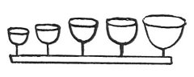

  
[Intangible Textual Heritage](../../index)  [Age of Reason](../index.md) 
[Index](index.md)   
[XVIII. Naval Warfare. Mechanical Appliances. Music. Index](dvs021.md)  
  [Previous](1129)  [Next](1131.md) 

------------------------------------------------------------------------

[Buy this Book at
Amazon.com](https://www.amazon.com/exec/obidos/ASIN/0486225739/internetsacredte.md)

------------------------------------------------------------------------

*The Da Vinci Notebooks at Intangible Textual Heritage*

### 1130.

Tymbals to be played like the monochord, or the soft flute.

 

\[6\] Here there is to be a cylinder of cane after the manner of
clappers with a musical round called a Canon, which is sung in four
parts; each singer singing the whole round. Therefore I here make a
wheel with 4 teeth so that each tooth takes by itself the part of a
singer.

 [630](#fn_296.md)

------------------------------------------------------------------------

### Footnotes

[282:630](1130.htm#fr_296.md) : In the original
there are some more sketches, to which the text, from line 6, refers.
They are studies for a contrivance exactly like the cylinder in our
musical boxes.

------------------------------------------------------------------------

[Next: 1131.](1131.md)
