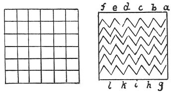

  
[Intangible Textual Heritage](../../index)  [Age of Reason](../index.md) 
[Index](index.md)   
[XVIII. Naval Warfare. Mechanical Appliances. Music. Index](dvs021.md)  
  [Previous](1130)  [Next](dv20479.md) 

------------------------------------------------------------------------

[Buy this Book at
Amazon.com](https://www.amazon.com/exec/obidos/ASIN/0486225739/internetsacredte.md)

------------------------------------------------------------------------

*The Da Vinci Notebooks at Intangible Textual Heritage*

### 1131.

 

 Of decorations.White and sky-blue cloths,
woven in checks to make a decoration.

Cloths with the threads drawn at *a b c d e f g h i k*, to go round the
decoration.

------------------------------------------------------------------------

[Next: Introduction](dv20479.md)
