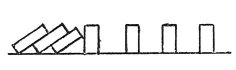

  
[Intangible Textual Heritage](../../index)  [Age of Reason](../index) 
[Index](index)   
[XIX. Philosophical Maxims. Morals. Polemics and Speculations
Index](dvs022)  
  [Previous](1165)  [Next](1167) 

------------------------------------------------------------------------

[Buy this Book at
Amazon.com](https://www.amazon.com/exec/obidos/ASIN/0486225739/internetsacredte)

------------------------------------------------------------------------

*The Da Vinci Notebooks at Intangible Textual Heritage*

### 1166.

 

One pushes down the other.

By these square-blocks are meant the life and the studies of men.

------------------------------------------------------------------------

[Next: 1167.](1167)
