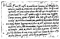

  
[Intangible Textual Heritage](../../index)  [Age of Reason](../index) 
[Index](index)   
[XXI. Letters. Personal Records. Dated Notes Index](dvs025)  
  [Previous](1339)  [Next](1341) 

------------------------------------------------------------------------

[Buy this Book at
Amazon.com](https://www.amazon.com/exec/obidos/ASIN/0486225739/internetsacredte)

------------------------------------------------------------------------

*The Da Vinci Notebooks at Intangible Textual Heritage*

### 1340.

 Drafts of Letters to Lodovico il Moro
(1340-1345).Most illustrious Lord, Having now sufficiently
considered the specimens of all those who proclaim themselves skilled
contrivers

p. 396

of instruments of war, and that the invention and operation of the said
instruments are nothing different to those in common use: I shall
endeavour, without prejudice to any one else, to explain myself to your
Excellency

[  
Click to enlarge](img/v239600.jpg)

showing your Lordship my secrets, and then offering them to your best
pleasure and approbation to work with effect at opportune moments as
well as all those things which, in part, shall be briefly noted below.

 [673](#fn_367)

p. 397

1\) I have a sort of extremely light and strong bridges, adapted to be
most easily carried, and with them you may pursue, and at any time flee
from the enemy; and others, secure and indestructible by fire and
battle, easy and convenient to lift and place. Also methods of burning
and destroying those of the enemy.

2\) I know how, when a place is besieged, to take the water out of the
trenches, and make endless variety of bridges, and covered ways and
ladders, and other machines pertaining to such expeditions.

3\) Item. If, by reason of the height of the banks, or the strength of
the place and its position, it is impossible, when besieging a place, to
avail oneself of the plan of bombardment, I have methods for destroying
every rock or other fortress, even if it were founded on a rock, &c

4\) Again I have kinds of mortars; most convenient and easy to carry;
and with these can fling small stones almost resembling a storm; and
with the smoke of these causing great terror to the enemy, to his great
detriment and confusion.

9\) \[8\] And when the fight should be at sea I have kinds of many
machines most efficient for offence and defence; and vessels which will
resist the attack of the largest guns and powder and fumes.

5\) Item. I have means by secret and tortuous mines and ways, made
without noise to reach a designated \[spot\], even if it were needed to
pass under a trench or a river.

6\) Item. I will make covered chariots, safe and unattackable which,
entering among the enemy with their artillery, there is no body of men
so great but they would break them. And behind these, infantry could
follow quite unhurt and without any hindrance.

7\) Item. In case of need I will make big guns, mortars and light
ordnance of fine and useful forms, out of the common type.

8\) Where the operation of bombardment should fail, I would contrive
catapults, mangonels, *trabocchi* and other machines of marvellous
efficacy and not in common use. And in short, according to the variety
of cases, I can contrive various and endless means of offence and
defence.

p. 398

10\) In time of peace I believe I can give perfect satisfaction and to
the equal of any other in architecture and the composition of buildings
public and private; and in guiding water from one place to another.

Item: I can carry out sculpture in marble, bronze or clay, and also in
painting whatever may be done, and as well as any other, be he whom he
may.

\[32\] Again, the bronze horse may be taken in hand, which is to be to
the immortal glory and eternal honour of the prince your father of happy
memory, and of the illustrious house of Sforza.

And if any one of the above-named things seem to any one to be
impossible or not feasible, I am most ready to make the experiment in
your park, or in whatever place may please your Excellency--to whom I
commend myself with the utmost humility &c

------------------------------------------------------------------------

### Footnotes

[396:673](1340.htm#fr_367) : The numerous
corrections, the alterations in the figures (l. 18) and the absence of
any signature prove that this is merely the rough draft of a letter to
Lodovico il Moro. It is one of the very few manuscripts which are
written from left to right--see the facsimile of the beginning as here
reproduced. This is probably the final sketch of a document the clean of
which copy was written in the usual manner. Leonardo no doubt very
rarely wrote so, and this is probably the reason of the conspicuous
dissimilarity in the handwriting, when he did. (Compare [Pl.
XXXVIII](dv20954.htm#img_pl038).) It is noteworthy too that here the
orthography and abbreviations are also exceptional. But such superficial
peculiarities are not enough to stamp the document as altogether
spurious. It is neither a forgery nor the production of any artist but
Leonardo himself. As to this point the contents leave us no doubt as to
its authenticity, particularly l. 32 (see No. 719, where this passage is
repeated). But whether the fragment, as we here see it, was written from
Leonardo's dictation--a theory favoured by the orthography, the erasures
and corrections--or whether it may be a copy made for or by Melzi or
Mazenta is comparatively unimportant. There are in the Codex Atlanticus
a few other documents not written by Leonardo himself, but the notes in
his own hand found on the reverse pages of these leaves amply prove that
they were certainly in Leonardo's possession. This mark of ownership is
wanting to the text in question, but the compilers of the Codex
Atlanticus, at any rate, accepted it as a genuine document.

With regard to the probable date of this projected letter see Vol. II,
p. 3.

------------------------------------------------------------------------

[Next: 1341.](1341)
