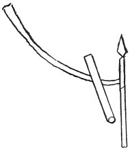

  
[Intangible Textual Heritage](../../index)  [Age of Reason](../index.md) 
[Index](index.md)   
[XXII. Miscellaneous Notes Index](dvs026.md)  
  [Previous](1379)  [Next](1381.md) 

------------------------------------------------------------------------

[Buy this Book at
Amazon.com](https://www.amazon.com/exec/obidos/ASIN/0486225739/internetsacredte.md)

------------------------------------------------------------------------

*The Da Vinci Notebooks at Intangible Textual Heritage*

### 1380.

 

This was done by Leone in the piazza of the castle with a chain and an
arrow.  [710](#fn_404.md)

------------------------------------------------------------------------

### Footnotes

[422:710](1380.htm#fr_404.md) : This note must
have been made in Milan; as we know from the date of the MS.

------------------------------------------------------------------------

[Next: 1381.](1381.md)
