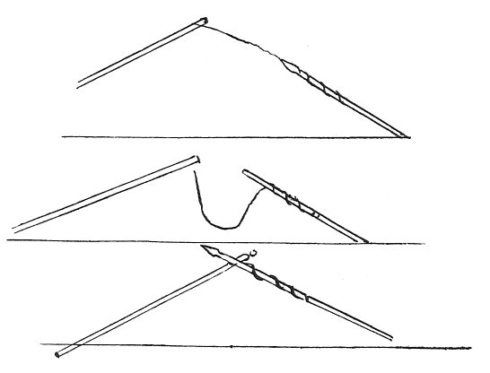

  
[Intangible Textual Heritage](../../index)  [Age of Reason](../index) 
[Index](index)   
[XXII. Miscellaneous Notes Index](dvs026)  
  [Previous](1406)  [Next](1408) 

------------------------------------------------------------------------

[Buy this Book at
Amazon.com](https://www.amazon.com/exec/obidos/ASIN/0486225739/internetsacredte)

------------------------------------------------------------------------

*The Da Vinci Notebooks at Intangible Textual Heritage*

### 1407.

I ask at what part of its curved motion the moving cause will leave the
thing moved and moveable.

 

Speak to Pietro Monti of these methods of throwing spears.

------------------------------------------------------------------------

[Next: 1408.](1408)
