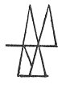

  
[Intangible Textual Heritage](../../index)  [Age of Reason](../index.md) 
[Index](index.md)   
[XXII. Miscellaneous Notes Index](dvs026.md)  
  [Previous](1502)  [Next](1504.md) 

------------------------------------------------------------------------

[Buy this Book at
Amazon.com](https://www.amazon.com/exec/obidos/ASIN/0486225739/internetsacredte.md)

------------------------------------------------------------------------

*The Da Vinci Notebooks at Intangible Textual Heritage*

### 1503.

 

of double the diameter cannot be moved by double the exertion, be- cause
the superficies of a body of the same form but twice as large has four
times the extent of the superficies of the smaller, as is shown in the
two figures a and n.

------------------------------------------------------------------------

[Next: 1504.](1504.md)
