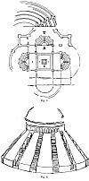

  
[Intangible Textual Heritage](../../index)  [Age of Reason](../index.md) 
[Index](index.md)   
[XII. Architectural Designs Index](dvs014.md)  
  [Previous](0757)  [Next](dv20063.md) 

------------------------------------------------------------------------

[Buy this Book at
Amazon.com](https://www.amazon.com/exec/obidos/ASIN/0486225739/internetsacredte.md)

------------------------------------------------------------------------

*The Da Vinci Notebooks at Intangible Textual Heritage*

p. 55

C. Studies for a form of a Church most proper for preaching.

The problem as to what form of church might answer the requirements of
acoustics seems to have engaged Leonardo's very particular attention.
The designation of "teatro" *given to some of these sketches, clearly
shows which plan seemed to him most favourable for hearing the
preacher's voice.*

[Pl. XCVII](pl097.htm#img_pl097), No. 1 (MS. B, 52.md). Rectangular edifice
divided into three naves with an apse on either side, terminated by a
semicircular theatre with rising seats, as in antique buildings. The
pulpit is in the centre. Leonardo has written on the left side of the
sketch: "teatro da predicare" *(Theatre for preaching).*

MS. B, 55a (see page 56, Fig. 1). A domed church after the type of [Pl.
XCV](pl095.htm#img_pl095.md), No. 1, shows four theatres occupying the
apses and facing the square "coro" *(choir), which is in the centre
between the four pillars of the dome.* [381](#fn_47.md) *The rising arrangement of the seats is
shown in the sketch above. At the place marked* B *Leonardo wrote*
teatri per uldire messa *(rows of seats to hear mass), at* T teatri,
*and at* C coro *(choir).*

In MS. C.A. 260, are slight sketches of two plans for rectangular choirs
and two elevations of the altar and pulpit which seem to be in
connection with these plans.

In MS. Ash II, 8a (see p. 56 and 57. Fig. 2 and 3). "Locho dove si
predica" *(Place for preaching). A most singular plan for a building.
The interior is a portion of a sphere, the centre of which is the summit
of a column destined to serve as the preacher's pulpit. The inside is
somewhat*

p. 56

[  
Click to enlarge](img/v205600.jpg.md)

p. 57

*like a modern theatre, whilst the exterior and the galleries and stairs
recall the ancient amphitheatres.*

*Page 57, Fig. 4. A plan accompanying the two preceding drawings. If
this gives the complete form Leonardo intended for the edifice, it
would*

[  
Click to enlarge](img/v205700.jpg.md)

*comprised only about two thirds of the circle. Leonardo wrote in the
centre* "fondamento", *a word he often employed for plans, and on the
left side of the view of the exterior:* locho dove si predicha *(a place
for preaching in).*

------------------------------------------------------------------------

### Footnotes

[55:381](dv20062.htm#fr_47.md) 1: The note *teatro
de predicar,* on the right side is, I believe, in the handwriting of
Pompeo Leoni. J. P. R.

------------------------------------------------------------------------

[Next: D. Design for a Mausoleum.](dv20063.md)
