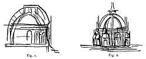
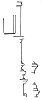

  
[Intangible Textual Heritage](../../index)  [Age of Reason](../index.md) 
[Index](index.md)   
[XII. Architectural Designs Index](dvs014.md)  
  [Previous](dv20063)  [Next](dv20065.md) 

------------------------------------------------------------------------

[Buy this Book at
Amazon.com](https://www.amazon.com/exec/obidos/ASIN/0486225739/internetsacredte.md)

------------------------------------------------------------------------

*The Da Vinci Notebooks at Intangible Textual Heritage*

p. 60

E. Studies for the Central Tower, or Tiburio of Milan Cathedral.

Towards the end of the fifteenth century the Fabbricceria del Duomo had
to settle on the choice of a model for the crowning and central part of
this vast building. We learn from a notice published by G. L. Calvi
 [384](#fn_50.md) that among the artists who
presented models in the year 1488 were: Bramante, Pietro da Gorgonzola,
Luca Paperio (Fancelli), and Leonardo da Vinci.--

Several sketches by Leonardo refer to this important project:

[Pl. XCIX](pl099.htm#img_pl099), No. 2 (MS. S. K. III, No. 36a.md) a small
plan of the whole edifice.--The projecting chapels in the middle of the
transept are wanting here. The nave appears to be shortened and seems to
be approached by an inner "vestibolo".--

[Pl. C](pl100.htm#img_pl100), No. 2 (Tr. 21.md). Plan of the octagon tower,
giving the disposition of the buttresses; starting from the eight
pillars adjoining the four principal piers and intended to support the
eight angles of the Tiburio. These buttresses correspond exactly with
those described by Bramante as existing in the model presented by
Omodeo.  [385](#fn_51.md)

*[Pl. C](pl100.htm#img_pl100), 3 (MS. Tr. 16.md). Two plans showing
different arrangements of the buttresses, which seem to be formed partly
by the intersection of a system of pointed arches such as that seen in*

[Pl. C](pl100.htm#img_pl100), No. 5 (MS. B, 27a.md) destined to give a
broader base to the drum. The text underneath is given under No. 788.

MS. B, 3--three slight sketches of plans in connexion with the preceding
ones.

p. 61

*[Pl. XCIX](pl099.htm#img_pl099), No.1 (MS. Tr. 15.md) contains several
small sketches of sections and exterior views of the Dome; some of them
show buttress-walls shaped as inverted arches. Respecting these Leonardo
notes:*

### 758.

The inverted arch is better for giving a shoulder than the ordinary one,
because the former finds below it a wall resisting its weakness, whilst
the latter finds in its weak part nothing but air.

*Three slight sketches of sections on the same leaf--above those
reproduced here--are more closely connected with the large drawing in
the centre of [Pl. C](pl100.htm#img_pl100), No. 4 (M.S, Tr. 41.md) which
shows a section of a very elevated dome, with double vaults, connected
by ribs and buttresses ingeniously disposed, so as to bring the weight
of the lantern to bear on the base of the dome.*

A sketch underneath it shows a round pillar on which is indicated which
part of its summit is to bear the weight: "il pilastro sara charicho in
. a . b." (The column will bear the weight at a b.) Another note is
above on the right side: Larcho regiera tanto sotto asse chome di sopra
se *(The arch supports as much below it \[i. e. a hanging weight\] as
above it).*

[Pl. C](pl100.htm#img_pl100), No. 1 (C. A. 303a.md). Larger sketch of half
section of the Dome, with a very complicated system of arches, and a
double vault. Each stone is shaped so as to be knit or dovetailed to its
neighbours. Thus the inside of the Dome cannot be seen from below.

MS. C. A. 303b. A repetition of the preceding sketch with very slight
modifications.

[  
Click to enlarge](img/v206100.jpg.md)

*MS. Tr. 9 (see Fig. 1 and 2). Section of the Dome with reverted
buttresses between the windows, above which iron anchors or chains seem
to be intended. Below is the sketch of the outside.*

p. 62

[  
Click to enlarge](img/v206200.jpg.md)

*[Pl. XCIX](pl099.htm#img_pl099), No. 3 (C. A., 262a.md) four sketches of
the exterior of the Dome.*

C. A. 12. Section, showing the points of rupture of a gothic vault, in
evident connection with the sketches described above.

It deserves to be noticed how easily and apparently without effort,
Leonardo manages to combine gothic details and structure with the more
modern shape of the Dome.

The following notes are on the same leaf, oni cosa poderosa, *and* oni
cosa poderosa desidera de(scendere); *farther below, several
multiplications most likely intended to calculate the weight of some
parts of the Dome, thus 16 x 47 = 720; 720 x 800 = 176000, next to which
is written:* peso del pilastro di 9 teste *(weight of the pillar 9
diameters high).*

Below: 176000 x 8 = 1408000; *and below:*

Semjlio e se ce 80 (?) il peso del tiburio *(six millions six hundred
(?) 80 the weight of the Dome).*

Bossi hazarded the theory that Leonardo might have been the architect
who built the church of Sta. Maria delle Grazie, but there is no
evidence to support this, either in documents or in the materials
supplied by Leonardos manuscripts and drawings. The sketch given at the
side shows the arrangement of the second and third socle on the apses of
the choir of that church; and it is remarkable that those sketches, in
MS. S. K. M. II2, 2a and Ib, occur with the passage given in Volume I as
No. 665 and 666 referring to the composition of the Last Supper in the
Refectory of that church.

------------------------------------------------------------------------

### Footnotes

[60:384](dv20064.htm#fr_50.md) : G. L. CALVI,
Notizie sulla vita e sulle opere dei principali architetti scultori e
pittori che fiorirono in Milano, Part III, 20. See also: H. DE
GEYMULLER, Les projets primitifs etc. I, 37 and 116-119.--The
Fabbricceria of the Duomo has lately begun the publication of the
archives, which may possibly tell us more about the part taken by
Leonardo, than has hitherto been known.

[60:385](dv20064.htm#fr_51.md) : *Bramante's
opinion was first published by G. MONGERl, Arch. stor. Lomb. V, fasc. 3
and afterwards by me in the publication mentioned in the preceding
note*.

------------------------------------------------------------------------

[Next: F. The Project for lifting up the Battistero of Florence and
setting it on a basement.](dv20065.md)
