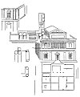
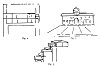

  
[Intangible Textual Heritage](../../index)  [Age of Reason](../index.md) 
[Index](index.md)   
[XII. Architectural Designs Index](dvs014.md)  
  [Previous](0759)  [Next](0760.md) 

------------------------------------------------------------------------

[Buy this Book at
Amazon.com](https://www.amazon.com/exec/obidos/ASIN/0486225739/internetsacredte.md)

------------------------------------------------------------------------

*The Da Vinci Notebooks at Intangible Textual Heritage*

p. 66

V. Palace architecture.

But a small number of Leonardo's drawings refer to the architecture of
palaces, and our knowledge is small as to what style Leonardo might have
adopted for such buildings.

[Pl. CII](pl102.htm#img_pl102) No. 1 (W. XVIII.md). A small portion of a
facade of a palace in two stories, somewhat resembling Alberti's Palazzo
Rucellai.--Compare with this Bramante's painted front of the Casa
Silvestri, and a painting by Montorfano in San Pietro in Gessate at
Milan, third chapel on the left hand side and also with Bramante's
palaces at Rome. The pilasters with arabesques, the rustica between
them, and the figures over the window may be painted or in sgraffito.
The original is drawn in red chalk.

[Pl. LXXXI](pl081.htm#img_pl081) No. 1 (MS. Tr. 42.md). Sketch of a palace
with battlements and decorations, most likely graffiti; the details
remind us of those in the Castello at Vigevano.  [388](#fn_54.md)

*MS. Mz. 0", contains a design for a palace or house with a loggia in
the middle of the first story, over which rises an attic with a Pediment
reproduced on page 67. The details drawn close by on the left seem to
indicate an arrangement of coupled columns against the wall of a first
story.*

[Pl. LXXXV](pl085.htm#img_pl085) No. 14 (MS. S. K. M. Ill 79a.md) contains
a very slight

p. 67

*sketch in red chalk, which most probably is intended to represent the
facade of a palace. Inside is the short note 7 he 7 (7 and 7).*

[  
Click to enlarge](img/v206700.jpg.md)

*MS. J2 8a (see pages 68 Fig. 1 and 2) contains a view of an unknown
palace. Its plan is indicated at the side.*

*In MS. Br. M. 126a(see Fig. 3 on page 68) there is a sketch of a house,
on which Leonardo notes; casa con tre terrazi (house with three
terraces).*

p. 68

*[Pl. CX](pl110.htm#img_pl110), No. 4 (MS. L. 36b.md) represents the front
of a fortified building drawn at Cesena in 1502 (see No. 1040).*

[  
Click to enlarge](img/v206800.jpg.md)

*Here we may also mention the singular building in the allegorical
composition represented on [Pl. LVIII](dv20957.htm#img_pl058.md) in Vol. I.
In front of it appears the head of a sphinx or of a dragon which seems
to be carrying the palace away.*

*The following texts refer to the construction of palaces and other
buildings destined for private use:*

------------------------------------------------------------------------

### Footnotes

[66:388](dv20067.htm#fr_54.md) 1: *Count GIULIO
PORRO, in his valuable contribution to the* Archivio Storico Lombardo,
Anno VIII, Fasc. IV (31 Dec. 1881): Leonardo da Vinci, Libro di
Annotazioni e Memorie, *refers to this in the following note:* "Alla
pag. 41 vi e uno schizzo di volta ed accanto scrisse: 'il pilastro sara
charicho in su 6' e potrebbe darsi che si riferisse alla cupola della
chiesa delle Grazie tanto piu che a pag. 42 vi e un disegno che
rassomiglia assai al basamento che oggi si vede nella parte esterna del
coro di quella chiesa." *This may however be doubted. The drawing, here
referred to, on page 41 of the same manuscript, is reproduced on [Pl.
C](pl100.htm#img_pl100.md) No. 4 and described on page 61 as being a study
for the cupola of the Duomo of Milan.* J. P. R.

------------------------------------------------------------------------

[Next: 760.](0760.md)
