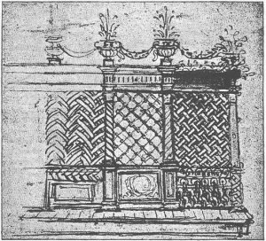

  
[Intangible Textual Heritage](../../index)  [Age of Reason](../index) 
[Index](index)   
[XIII. Theoretical Writings on Architecture Index](dvs015)  
  [Previous](0795)  [Next](dv20107) 

------------------------------------------------------------------------

[Buy this Book at
Amazon.com](https://www.amazon.com/exec/obidos/ASIN/0486225739/internetsacredte)

------------------------------------------------------------------------

*The Da Vinci Notebooks at Intangible Textual Heritage*

p. 100

Remarks on the style of Leonardo's architecture.

A few remarks may here be added on the style of Leonardo's architectural
studies. However incomplete, however small in scale, they allow us to
establish a certain number of facts and probabilities, well worthy of
consideration.

When Leonardo began his studies the great name of Brunellesco was still
the inspiration of all Florence, and we cannot doubt that Leonardo was
open to it, since we find among his sketches the plan of the church of
Santo Spirito [408](#fn_74) *and a lateral view
of San Lorenzo ([Pl. XCIV](pl094.htm#img_pl094) No. 1), a plan almost
identical with the chapel Degli Angeli, only begun by him ([Pl.
XCIV](pl094.htm#img_pl094), No. 3) while among Leonardo's designs for
domes several clearly betray the influence of Brunellesco's Cupola and
the lantern of Santa Maria del Fiore* [409](#fn_75)

*The beginning of the second period of modern Italian architecture falls
during the first twenty years of Leonardo's life. However the new
impetus given by Leon Battista Alberti either was not generally
understood by his contemporaries, or those who appreciated it, had no
opportunity of showing that they did so. It was only when taken up by
Bramante and developed by him to the highest rank of modern architecture
that this new influence was generally felt. Now the peculiar feature of
Leonardo's sketches is that, like the works of Bramante, they appear to
be the development and continuation of Alberti's.*

p. 101

*But a question here occurs which is difficult to answer. Did Leonardo,
till he quitted Florence, follow the direction given by the dominant
school of Brunellesco, which would then have given rise to his "First
manner", or had he, even before he left Florence, felt Alberti's
influence--either through his works (Palazzo Ruccellai, and the front of
Santa Maria Novella) or through personal intercourse? Or was it not till
he went to Milan that Alberti's work began to impress him through
Bramante, who probably had known Alberti at Mantua about 1470 and who
not only carried out Alberti's views and ideas, but, by his designs for
St. Peter's at Rome, proved himself the greatest of modern architects.
When Leonardo went to Milan Bramante had already been living there for
many years. One of his earliest works in Milan was the church of Santa
Maria presso San Satiro, Via del Falcone* [410](#fn_76) .

*Now we find among Leonardos studies of Cupolas on Plates
[LXXXIV](pl084.htm#img_pl084) and [LXXXV](pl085.htm#img_pl085) and in
[Pl. LXXX](pl080.htm#img_pl080) several sketches which seem to me to
have been suggested by Bramante's dome of this church.*

The MSS. B and Ash. II contain the plans of S. Sepolcro, the pavilion in
the garden of the duke of Milan, and two churches, evidently inspired by
the church of San Lorenzo at Milan.

MS. B. contains besides two notes relating to Pavia, one of them a
design for the sacristy of the Cathedral at Pavia, which cannot be
supposed to be dated later than 1492, and it has probably some relation
to Leonardo's call to Pavia June 21, 1490 [411](#fn_77) . *These and other considerations
justify us in concluding, that Leonardo made his studies of cupolas at
Milan, probably between the years 1487 and 1492 in anticipation of the
erection of one of the grandest churches of Italy, the Cathedral of
Pavia. This may explain the decidedly Lombardo-Bramantesque tendency in
the style of these studies, among which only a few remind us of the
forms of the cupolas of S. Maria del Fiore and of the Baptistery of
Florence. Thus, although when compared with Bramante's work, several of
these sketches plainly reveal that master's influence, we find, among
the sketches of domes, some, which show already Bramante's classic
style, of which the Tempietto of San Pietro in Montorio, his first
building executed at Rome, is the foremost example* [412](#fn_78) .

*On Plate [LXXXIV](pl084.htm#img_pl084) is a sketch of the plan of a
similar circular building; and the Mausoleum on [Pl.
XCVIII](pl098.htm#img_pl098), no less than one of the pedestals for the
statue of Francesco Sforza ([Pl. LXV](dv20000.htm#img_pl065)), is of the
same type.*

p. 102

*The drawings [Pl. LXXXIV](pl084.htm#img_pl084) No. 2, [Pl.
LXXXVI](pl086.htm#img_pl086) No. 1 and 2 and the ground
[floor](errata.htm#0) of the building in the drawing [Pl.
XCI](pl091.htm#img_pl091) No. 2, with the interesting decoration by
gigantic statues in large niches, are also, I believe, more in the style
Bramante adopted at Rome, than in the Lombard style. Are we to conclude
from this that Leonardo on his part influenced Bramante in the sense of
simplifying his style and rendering it more congenial to antique art?
The answer to this important question seems at first difficult to give,
for we are here in presence of Bramante, the greatest of modern
architects, and with Leonardo, the man comparable with no other. We have
no knowledge of any buildings erected by Leonardo, and unless we admit
personal intercourse--which seems probable, but of which there is no
proof--, it would be difficult to understand how Leonardo could have
affected Bramante's style. The converse is more easily to be admitted,
since Bramante, as we have proved elsewhere, drew and built
simultaneously in different manners, and though in Lombardy there is no
building by him in his classic style, the use of brick for building, in
that part of Italy, may easily account for it.*

*Bramante's name is incidentally mentioned in Leonardo's manuscripts in
two passages (Nos. 1414 and 1448). On each occasion it is only a slight
passing allusion, and the nature of the context gives us no due
information as to any close connection between the two artists.*

*It might be supposed, on the ground of Leonardo's relations with the
East given in sections XVII and XXI of this volume, that some evidence
of oriental influence might be detected in his architectural drawings. I
do not however think that any such traces can be pointed out with
certainty unless perhaps the drawing for a Mausoleum, [Pl.
XC](pl090.htm#img_pl090) VIII.*

*Among several studies for the construction of cupolas above a Greek
cross there are some in which the forms are decidedly monotonous. These,
it is clear, were not designed as models of taste; they must be regarded
as the results of certain investigations into the laws of proportion,
harmony and contrast.*

*The designs for churches, on the plan of a Latin cross are evidently
intended to depart as little as possible from the form of a Greek cross;
and they also show a preference for a nave surrounded with outer
porticos.*

*The architectural forms preferred by Leonardo are pilasters coupled
([Pl. LXXXII](pl082.htm#img_pl082) No. 1; or grouped ([Pl.
LXXX](pl080.htm#img_pl080) No. 5 and [XCIV](pl094.htm#img_pl094) No. 4),
often combined with niches. We often meet with orders superposed, one in
each story, or two small orders on one story, in combination with one
great order ([Pl. XCVI](pl096.htm#img_pl096) No. 2).*

p. 103

*The drum (tamburo) of these cupolas is generally octagonal, as in the
cathedral of Florence, and with similar round windows in its sides. In
[Pl. LXXXVII](pl087.htm#img_pl087) No. 2 it is circular like the model
actually carried out by Michael Angelo at St. Peter's.*

The cupola itself is either hidden under a pyramidal roof, as in the
Baptistery of Florence, San Lorenzo of Milan and most of the Lombard
churches ([Pl. XCI](pl091.htm#img_pl091) No. 1 and [Pl.
XCII](pl092.htm#img_pl092) No. 1); but it more generally suggests the
curve of Sta Maria del Fiore ([Pl. LXXXVIII](pl088.htm#img_pl088) No. 5;
[Pl. XC](pl090.htm#img_pl090) No. 2; [Pl. LXXXIX](pl089.htm#img_pl089),
M; [Pl. XC](pl090.htm#img_pl090) No. 4, [Pl. XCVI](pl096.htm#img_pl096)
No. 2). In other cases ([Pl. LXXX](pl080.htm#img_pl080) No. 4; [Pl.
LXXXIX](pl089.htm#img_pl089); [Pl. XC](pl090.htm#img_pl090) No. 2) it
shows the sides of the octagon crowned by semicircular pediments, as in
Brunellesco's lantern of the Cathedral and in the model for the
Cathedral of Pavia.

Finally, in some sketches the cupola is either semicircular, or as in
[Pl. LXXXVII](pl087.htm#img_pl087) No. 2, shows the beautiful line,
adopted sixty years later by Michael Angelo for the existing dome of St.
Peter's.

It is worth noticing that for all these domes Leonardo is not satisfied
to decorate the exterior merely with ascending ribs or mouldings, but
employs also a system of horizontal parallels to complete the
architectural system. Not the least interesting are the designs for the
tiburio (cupola) of the Milan Cathedral. They show some of the forms,
just mentioned, adapted to the peculiar gothic style of that monument.

The few examples of interiors of churches recall the style employed in
Lombardy by Bramante, for instance in S. Maria di Canepanuova at Pavia,
or by Dolcebuono in the Monastero Maggiore at Milan (see [Pl.
CI](pl101.htm#img_pl101) No. 1 \[C. A. 181b; 546b\]; [Pl.
LXXXIV](pl084.htm#img_pl084) No. 10).

The few indications concerning palaces seem to prove that Leonardo
followed Alberti's example of decorating the walls with pilasters and a
flat rustica, either in stone or by graffitti ([Pl.
CII](pl102.htm#img_pl102) No. 1 and [Pl. LXXXV](pl085.htm#img_pl085) No.
14).

By pointing out the analogies between Leonardo's architecture and that
of other masters we in no way pretend to depreciate his individual and
original inventive power. These are at all events beyond dispute. The
project for the Mausoleum ([Pl. XCVIII](pl098.htm#img_pl098)) would
alone suffice to rank him among the greatest architects who ever lived.
The peculiar shape of the tower ([Pl. LXXX](pl080.htm#img_pl080)), of
the churches for preaching ([Pl. XCVII](pl097.htm#img_pl097) No. 1 and
pages 56 and 57, Fig. 1-4), his curious plan for a city with high and
low level streets ([Pl. LXXVII](pl077.htm#img_pl077) and
[LXXVIII](pl078.htm#img_pl078) No. 2 and No. 3), his Loggia with
fountains ([Pl. LXXXII](pl082.htm#img_pl082) No. 4) reveal an
originality, a power and facility of invention for almost any given
problem, which are quite wonderful.

p. 104

*In addition to all these qualities he propably stood alone in his day
in one department of architectural study,--his investigations, namely,
as to the resistance of vaults, foundations, walls and arches.*

*As an application of these studies the plan of a semicircular vault
([Pl. CIII](pl103.htm#img_pl103) No. 2) may be mentioned here, disposed
so as to produce no thrust on the columns on which it rests:* volta i
botte e non ispignie ifori le colone. *Above the geometrical patterns on
the same sheet, close to a circle inscribed in a square is the note:* la
ragio d'una volta cioe il terzo del diamitro della sua ... del tedesco
in domo.

*There are few data by which to judge of Leonardo's style in the
treatment of detail. On [Pl. LXXXV](pl085.htm#img_pl085) No. 10 and [Pl.
CIII](pl103.htm#img_pl103) No. 3, we find some details of pillars; on
[Pl. CI](pl101.htm#img_pl101) No. 3 slender pillars designed for a
fountain and on [Pl. CIII](pl103.htm#img_pl103) No. 1 MS. B, is a pen
and ink drawing of a vase which also seems intended for a fountain.
Three handles seem to have been intended to connect the upper parts with
the base. There can be no doubt that Leonardo, like Bramante, but unlike
Michael Angelo, brought infinite delicacy of motive and execution to
bear on the details of his work.*

 

------------------------------------------------------------------------

### Footnotes

[100:408](dv20106.htm#fr_74) 1: See [Pl.
XCIV](pl094.htm#img_pl094), No. 2. Then only in course of erection after
the designs of Brunellesco, though he was already dead; finished in
1481.

[100:409](dv20106.htm#fr_75) 2: A small sketch
of the tower of the Palazzo della Signoria (MS. C.A. 309) proves that he
also studied mediaeval monuments.

[101:410](dv20106.htm#fr_76) 1: Evidence of this
I intend to give later on in a Life of Bramante, which I have in
preparation.

[101:411](dv20106.htm#fr_77) 2: The sketch of
the plan of Brunellesco's church of Santo Spirito at Florence, which
occurs in the same Manuscript, may have been done from memory.

[101:412](dv20106.htm#fr_78) 3: It may be
mentioned here, that in 1494 Bramante made a similar design for the
lantern of the Cupola of the Church of Santa Maria delle Grazie.

------------------------------------------------------------------------

[Next: Introduction](dv20107)
