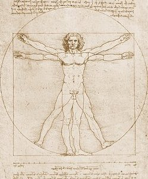

[Intangible Textual Heritage](../../index)  [Age of Reason](../index.md) 

------------------------------------------------------------------------

  

------------------------------------------------------------------------

<table width="75%">
<colgroup>
<col style="width: 50%" />
<col style="width: 50%" />
</colgroup>
<tbody>
<tr class="odd">
<td width="50%" data-valign="CENTER"> 
</td>
<td width="50%" data-valign="CENTER"><h1 id="the-notebooks-of-leonardo-da-vinci" data-align="CENTER">The Notebooks of Leonardo Da Vinci</h1>
<h2 id="by-jean-paul-richter" data-align="CENTER">by Jean Paul Richter</h2>
<h4 id="section" data-align="CENTER">[1883]</h4></td>
</tr>
</tbody>
</table>

------------------------------------------------------------------------

[Contents](#contents)    [Start Reading](v1title.md)  

------------------------------------------------------------------------

|                                                                                                                           |
|---------------------------------------------------------------------------------------------------------------------------|
|  |

|                                                                                                                           |
|---------------------------------------------------------------------------------------------------------------------------|
|  |

Leonardo Da Vinci, arguably the central figure of the Renaissance, has
long been considered by many a man of mystery. This is in spite of the
fact that we have an unparalleled set of documents which illuminate his
thought processes, interests, and deepest beliefs. We have access to
hundreds of pages of his notes, jottings, sketches, doodles, and
musings, including lists of books he read and even scraps of financial
records. All of the known Da Vinci papers as of the mid-19th century are
included here in this magnificent collection.

What emerges is the picture of a rationalist. For instance, Da Vinci was
one of the first to question the Biblical account of the Flood. He saw
the fossils of sea creatures on the tops of mountains and concluded that
these could not have been deposited in a forty day flood. He looked at
river valleys and did the math; they could only have been eroded over
huge horizons of time.

Da Vinci put as much thought into his art as he did his science.
Practically half of the writings here relate to detailed studies of the
natural world which informed his work as an artist.

This is the first time that the Da Vinci notebooks have appeared on the
Internet with all of the images in context. This electronic edition is
based on the Project Gutenberg etext, with extensive additional work at
Intangible Textual Heritage, including scanning of missing material,
formatting to match the copytext and hyperlinking.

------------------------------------------------------------------------

### Vol. I

[Title Page](v1title.md)  
[Preface](v1pref.md)  
[Contents of Volume I](v1cont.md)  
[List of Illustrations in Volume I](v1illu.md)  
[I. Prolegomena and General Introduction to the Book on
Painting](dvs000.md)  
[II. Linear Perspective](dvs001.md)  
[III. Six Books on Light and Shade](dvs002.md)  
[Plates II-XXXV](dvs003.md)  
[IV. Perspective of Disappearance](dvs004.md)  
[V. Theory of Colours](dvs005.md)  
[VI. Perspective of Colour and Aerial Perspective](dvs006.md)  
[VII. On the Proportions and on the Movements of the Human
Figure](dvs007.md)  
[Plates XXXVI-LXIV](dvs008.md)  
[VIII. Botany for Painters and Elements of Landscape Painting](dvs009.md)  
[IX. The Practice of Painting](dvs010.md)  
[X. Studies and Sketches for Pictures and Decorations](dvs011.md)  
[Duplicate Plates (vol. I)](dvs012.md)  

------------------------------------------------------------------------

### Vol. II

[Title Page](dv20000.md)  
[Contents of Volume II](v2cont.md)  
[List of Illustrations in Volume II.](v2illu.md)  
[XI. The Notes on Sculpture](dvs013.md)  
[XII. Architectural Designs](dvs014.md)  
[XIII. Theoretical Writings on Architecture](dvs015.md)  
[XIV. Anatomy, Zoology and Physiology](dvs016.md)  
[Plates LXVI-XCVI](dvs017.md)  
[XV. Astronomy](dvs018.md)  
[XVI. Physical Geography](dvs019.md)  
[XVII. Topographical Notes](dvs020.md)  
[XVIII. Naval Warfare. Mechanical Appliances. Music.](dvs021.md)  
[XIX. Philosophical Maxims. Morals. Polemics and Speculations](dvs022.md)  
[Plates XCII-CXXII](dvs023.md)  
[XX. Humorous Writings](dvs024.md)  
[XXI. Letters. Personal Records. Dated Notes](dvs025.md)  
[XXII. Miscellaneous Notes](dvs026.md)  
[Duplicate Plates (vol. II)](dvs027.md)  
