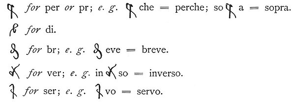
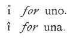
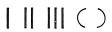
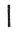
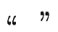
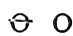
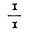

  
[Intangible Textual Heritage](../../index)  [Age of Reason](../index.md) 
[Index](index.md)   
[I. Prolegomena and General Introduction to the Book on Painting
Index](dvs000.md)  
  [Previous](v1illu)  [Next](0001.md) 

------------------------------------------------------------------------

[Buy this Book at
Amazon.com](https://www.amazon.com/exec/obidos/ASIN/0486225720/internetsacredte.md)

------------------------------------------------------------------------

*The Da Vinci Notebooks at Intangible Textual Heritage*

p. 1

### *I.*

### *Prolegomena and General Introduction to the Book on Painting.*

### *Clavis sigillorum.*

1\. *In the few instances in which Leonardo has written from left to
right in the ordinary way this is stated in a note. In all other cases
the writing is backwards*.

2\. *The numbers printed above the line in the revised text:*
2, 3, 4 *&c. indicate the heads of the
lines in the original MS. In many instances the breaking off of the
lines in the original MS. accounts for peculiarities in the construction
of Leonardo's sentences. In the translation the numbers refer only to
the footnotes and they have been introduced in such passages, which
require an explanation*.

3\. *Clerical errors and obvious mistakes in spelling have been
corrected in the text, but are given in the notes, so that all the
peculiarities of the original text which are omitted in the revised text
may be seen at a glance*.

4\. *Leonardo frequently employs the following abbreviations:*--

 

*These occur so constantly and are so unimportant that it has not been
thought necessary to point them out. He also uses:*

 

p. 2

5\. *Such abbreviations as are common in familiar speech are retained in
the text;* *e. g.* un sol punto.

6\. *Leonardo's usual way of spelling*, ochio spechio *for* occhio
specchio, *has also been left unaltered*.

7\. *The combinations of two or three words into one, which Leonardo so
frequently used, and which are so puzzling to the eye as to render
reading difficult, though plain to the ear, have been separated in the
revised text;* *e. g.* leforme ditutti = le forme di tutti. *These
combinations were, however, intentional no doubt; in almost every case
they indicate the author's desire of substituting a sort of phonetic
writing for the rules in general use. This doubling of the letters--as,
for instance in* chessia *for* che sia *and* essella *for* e se la--*is,
I believe, clear evidence of what may be called the orthography of
Leonardo da Vinci. The separation of the words has involved the loss of
these doubled letters, but the original spelling has been given, for
reference, in the foot notes*.

8\. *Leonardo commonly wrote* ā ē ī ō ū or v̊ *for* an, en, in, on, un.
*This sign occasionally, but not often, represents m. It has been
retained, as it was usual in printed type in the XVth and
XVIth centuries*.

9\. *Leonardo sometimes writes* j *for* i, *particularly where it is
joined to* m, n *or* u; *e. g.* linje, tienj, mjnor. *As he never sets a
dot over the ordinary* i *(at any rate when he writes from right to
left), it is plain that he uses* j *for* i *(he does not dot the* j)
*simply to avoid confounding* ni *or* ui *with* m, *or* mi *with* nu.
*As this difficulty cannot occur in print I have restored the usual
spelling* i *for* j *without referring to it in the notes*.

10\. *Accents and apostrophes are entirely lacking in the original
manuscript, but it seemed necessary to introduce them into the printed
text. The accent has also been added in those parts of the verb* avere
*in which Leonardo had dropped the* h: as ò, ài, à, ànno.

11\.   *In the MSS.
there are no marks of punctuation but these, and they have been retained
wherever they occur. • is always placed by Leonardo just above the line
of writing and is never used as a full stop, but only to divide the
words according to the sense; it very often occurs between every word,
particularly in MSS. of about 1490. When a letter or number is placed
between two points, as* . a ., *or* . 3 ., *it usually refers to a
corresponding sign on a diagram or sketch*.

  *commonly serve to
separate sentences which are entirely distinct*.

  . *This mark
commonly indicates that words written above or below the line are to be
inserted. In the revised text they have been simply inserted*.

*In the notes these passages are distinguished by the following
signs:*--

« » *indicates that the words were written above the line*.

  *that the words were
written below the line*.

() *This mark is used by Leonardo to mark off a digression, or
parenthesis, or a quotation from some other work of his own; but it
often takes the place of the colon:*

( *A simple bracket placed at the beginning of one or more lines serves
to lay stress on particular sentences; it is also used to mark distinct
sentences which have no connection with the rest of the text on the same
page. In the printed text such sentences have been denoted by the mark*
¶.

p. 3

-- *The last line of a section commonly ends with a horizontal line of
variable length, making it of equal length with the preceding lines of
writing*.

12\. 3, 4, 5. *These figures, if written large, or some similar mark,
are occasionally placed at the end of a page or at the beginning of a
passage that has been crossed out; and this indicates that the
continuation is to be sought for elsewhere, where the same sign is
repeated*.

*The signs*   , *which
occur in the passages on painting, have been added by some early copyist
and have therefore not been reproduced in the notes*.

13\. , . : ; ! ? *These stops are never used in the original MSS. It
seemed necessary however to insert such marks in order to render the
text intelligible. A full stop is only used at the end of a section to
avoid confusion with Leonardo's own use of points (see No*. 11), *for he
never places one at the end of a section or paragraph. Wherever a full
stop seemed wanting in the course of the text I have put a semi colon ()
The colon (:) is used instead of a full stop where, in the original, a
point (.) occurs*.

14\. \[ \] *Passages between brackets are crossed out in the original*.

15\. *When a word or passage of the revised text is printed in small
type it indicates that the reading is doubtful in consequence of partial
obliteration*.

16\. *indicates passages in which the original writing is entirely
destroyed*.

17\. R *indicates that the passage is written in red chalk*.

18\. (R) *indicates that the original writing in red chalk has been
written over in pen and ink*.

19\. P *indicates that the original writing is in silverpoint*.

20\. 1*a* 2*a* 3*a* *&c. the front
page*--recto--*of sheet* 1, 2, 3, *&c*.

    1*b* 2*b* 3*b* *&c. the back
page*--verso--*of sheet* 1, 2, 3, *&c*.

*The MSS*. Tr. *and* S. K. M. I2 *are the only ones in which
the pages are numbered. In all other MSS. the leaf only is numbered. In
referring to the Codex Atlanticus a double series of numbers has been
used. The first apply only to the larger leaves of the Codex, on which
two or more of the original leaves of the MS. have been mounted; the
second series does not exist in the Codex itself; it refers to the
original pages in the order in which they have been placed in it. By
this second series of numbers the correspondence of the front and back
pages has been verified. Wherever, in addition to the consecutive
numbering, a different number occurs in Leonardo's writing it is quoted
in a parenthesis, thus:*--C 27*b* (3*a*), a*nd
this indicates that the back page of leaf* 27 *in the MS*. C *was
originally numbered* 3.

21\. *A Roman* II, *as* 26 II*a* 26 II*b*,
*indicates that the same number* (26) *occurs twice. In the Codex
Atlanticus*   *is used
for II*.

22\. O′, O″ *indicates that the passages so marked are originally notes
written on the inside of the cover of the MS*.; O′ *within the front or
upper cover*, O″ *within the under cover*.

23\. *The wood-cuts introduced into the text are facsimile-reproductions
of Leonardo's own sketches and drawings which accompany the MSS. But the
letters and numbers affixed to them have been inserted in ordinary
writing*.

p. 4

24\. *The following is a list of Leonardo's letters and numbers, as they
are found on those original drawings which are here reproduced by
facsimile engravings. The reader will have to refer to this list, by
which he will be enabled to identify the letters and numbers on the
originals with the corresponding figures in the printed text*.

|      |                    |                                                                                                               |                                                            |                       |                     |                                |
|------|--------------------|---------------------------------------------------------------------------------------------------------------|------------------------------------------------------------|-----------------------|---------------------|--------------------------------|
|      | MARK OF MANUSCRIPT | DESCRIPTION OF MANUSCRIPT                                                                                     | PLACE                                                      | TOTAL NUMBER OF PAGES | SIZE IN CENTIMÈTRES | DATE                           |
| 1\.  | W. An. I.          | Fragment of first treatise on Anatomy.                                                                        | Royal Library, Windsor.                                    | 10                    | 18,7 X 13,2         | 1489                           |
| 2\.  | C.                 | Treatise on Light and Shade, bound, marked C.                                                                 | Institut de France, Paris.                                 | 56                    | 31 X 22             | 1490, 1491                     |
| 3\.  | B.                 | Bound Volume, marked B.                                                                                       | Institut de France, Paris.                                 | 168                   | 23,5 X 17           | about 1490                     |
| 4\.  | Ash. II.           | Volume stitched in wrapper, marked 1875/1, in the Library of Lord Ashburnham.                                 | Ashburnham Place, Sussex.                                  | 26                    | 24 X 17             | about 1490                     |
| 5\.  | Ash. I.            | Fragment of the *Libra di Pittura* , 1875 marked 1875/2, in the Library of Lord Ashburnham.                   | Ashburnham Place, Sussex.                                  | 68                    | 21 X 11,5           | 1492                           |
| 6\.  | A.                 | Fragment of MS., treating on various matters.                                                                 | Institut de France, Paris.                                 | 126                   | 21 X 14             | 1492                           |
| 7\.  | S. K. M. III.      | Notebook, marked III.                                                                                         | Forster Library,South Kensington Museum, London.           | 176                   | 9 X 6,7             | 1493                           |
| 8\.  | H.3                | Notebook, forming the third portion of the bound Volume, marked H.                                            | Institut de France, Paris.                                 | 94                    | 10,3 X 7,2          | 1493, 1494                     |
| 9\.  | H.2                | Notebook, forming the second portion of the bound Volume, marked H.                                           | Institut de France, Paris.                                 | 92                    | 10,3X7,2            | 1494, January                  |
| 10\. | H.1                | Notebook, forming the first portion of the bound Volume, marked H.                                            | Institut de France, Paris.                                 | 96                    | 10,3 X 7,2          | 1494, March                    |
| 11\. | S. K. M. II.2      | Notebook, forming the second part of the bound Volume, marked II.                                             | ForsterLibrary,South Kensington Museum, London.            | 126                   | 9,9 X 7,2           | 1493-1495                      |
| 12\. | S. K. M. II.1      | Notebook, forming the first part of the bound Volume, marked II.                                              | ForsterLibrary,South Kensington Museum, London.            | 190                   | 9,9 X 7,2           | 1495                           |
| 13\. | I.2                | Notebook, forming the second part of the bound Volume, marked I.                                              | Institut de France, Paris.                                 | 182                   | 10 X 7,2            | 1497                           |
| 14\. | I.1                | Notebook, forming the first portion of the bound Volume, marked I.                                            | Institut de France, Paris.                                 | 96                    | 10 X 7,2            | 1497 ?                         |
| 15\. | W. P.              | Studies on the Proportions of the Human Figure, loose sheets.                                                 | Royal Library, Windsor.                                    | 19                    | various large sizes | 1490-1495                      |
| 16\. | W. H.              | Treatise on the Anatomy of the Horse, loose sheets.                                                           | Royal Library, Windsor.                                    | 80                    | various sizes       | 1490-1495                      |
| 17\. | W. An. II.         | Second treatise on Anatomy, loose sheets.                                                                     | Royal Library, Windsor.                                    | 72                    | 19 X 13,5           | 1490-1500                      |
|      |                    | p. 6                                                                                 |                                                            |                       |                     |                                |
| 18\. | L.                 | Notebook, in original binding, marked L.                                                                      | Institut de France, Paris.                                 | 188                   | 10 X 7              | 1502                           |
| 19\. | W. M.              | Collection of Maps.                                                                                           | Royal Library, Windsor.                                    | 12                    | various large sizes | about 1502                     |
| 20\. | S. K. M. I.I       | Treatise on Stereometry, first portion of a bound Volume, marked I.                                           | ForsterLibrary,South Kensington Museum, London.            | 76                    | 14 X 10,5           | 1505                           |
| 21\. | S. K. M. I.2       | Notebook, second portion of abound Volume, marked I.                                                          | ForsterLibrary,South Kensington Museum, London.            | 28                    | 14 X 10,5           | about 1505                     |
| 22\. | F.                 | Notebook, in original binding, marked F.                                                                      | Institut de France, Paris.                                 | 192                   | 15 X 10,2           | 1508                           |
| 23\. | Br. M.             | Collection of treatises and notes, bound Volume, marked: Arundel 263.                                         | British Museum, London.                                    | 566                   | 19 X 12,5           | about 1509                     |
| 24\. | W. An. III.        | Third treatise on Anatomy, loose sheets of greyish-blue colour.                                               | Royal Library, Windsor.                                    | 46                    | 29 X 21             | 1513                           |
| 25\. | E.                 | Notebook, in original binding, marked E.                                                                      | Institut de France, Paris.                                 | 16o                   | 15,4X9,3            | 1513 and 1514                  |
| 26\. | G.                 | Notebook, in original binding, marked G.                                                                      | Institut de France, Paris.                                 | 186                   | 14X10               | about 1515                     |
| 27\. | M.                 | Notebook, in original binding, marked M.                                                                      | Institut de France, Paris.                                 | 188                   | tox7                | about 1515                     |
| 28\. | Tr.                | Volume treating on various matters, bound, in possession of Marchese G. G. Trivulzio.                         | Trivulzi Palace, Milan.                                    | 102                   | 21 X 14             | between 1497 and 1516          |
| 29\. | Leic.              | Bound Volume, containing chiefly scientific observations.                                                     | Leicester Library, Holkham Hall, Norfolk.                  | 72                    | 30 X 22             | between 1500 and 1516, 15 to ? |
| 30\. | Mz.                | Volume treating on various subjects, in original binding.                                                     | In possession of Count Manzoni, Rome.                      | 26                    | 21,3 X 15,5         | between 1490 and 1516          |
| 31\. | D.                 | Treatise on the Eye, in original binding, marked D.                                                           | Institut de France, Paris.                                 | 20                    | 25 X 16             | between 1490 and 1516          |
| 32\. | K.1                | Notebook, forming the first part of a bound Volume, marked K.                                                 | Institut de France, Paris.                                 | 96                    | 10 X 6,6            | after 1504                     |
| 33\. | K.2                | Notebook, forming the second part of a bound Volume, marked K.                                                | Institut de France, Paris.                                 | 62                    | 10 X 6,6            | after 1504                     |
| 34\. | K.3                | Notebook, forming the third part of a bound Volume, marked K.                                                 | Institut de France, Paris.                                 | 96                    | 10 X 6,6            | after 1504                     |
| 35\. | W. An. IV.         | Fourth treatise on Anatomy, loose sheets.                                                                     | Royal Library, Windsor.                                    | 138                   | 29 X 22             | about 1515                     |
| 36\. | W. L.              | Collection of loose sheets in bound Volume (Fragment of Leoni's collection).                                  | Royal Library, Windsor.                                    | 30                    | various large sizes | 1490-1516                      |
| 37\. | W.                 | Loose sheets, partly mounted.                                                                                 | Royal Library, Windsor.                                    |                       | various sizes       | about 1490-1516                |
|      |                    | p. 7                                                                                 |                                                            |                       |                     |                                |
| 38\. | C. A.              | Bound Volume, commonly called Codex Atlanticus, 395 folios, each containing one or more MS-sheets.            | Ambrosian Library, Milan.                                  | 1222                  | various sizes       | about 1483 1518                |
| 39\. | Trn.               | five loose sheets.                                                                                            | Royal Library, Turin.                                      | 10                    | various sizes       | uncertain                      |
| 40\. | F. U.              | two loose sheets.                                                                                             | Uffizi Gallery, Florence.                                  | 4                     | various sizes       | 1473 and 1478                  |
| 41\. | V.                 | five loose sheets.                                                                                            | Academy, Venice.                                           | 10                    | various sizes       | uncertain                      |
| 42\. | Mi. A.             | one sheet.                                                                                                    | Gallery in the Ambrosian Library, Milan.                   | 2                     | 20 X 14             | uncertain                      |
| 43\. | Mi. A. R.          | one sheet.                                                                                                    | Ambrosian Library, Cod. Resta.                             | 2                     | 80                  | uncertain                      |
| 44\. | Mch.               | one sheet.                                                                                                    | Pinakothek, Munich.                                        | 2                     | 4°                  | uncertain                      |
| 45\. | P. V.              | ane sheet, marked N. 2260.                                                                                    | Cod.Vallardi,Louvre, Paris.                                | 2                     | 4°                  | uncertain                      |
| 46\. | P. L.              | one sheet (previously in the Collection of the King of Holland).                                              | Collection of drawings, Louvre, Paris.                     | 2                     | 27,7 X 21           | about 1480-1500                |
| 47\. | P. A.              | one sheet.                                                                                                    | Collection of drawings, M. Armand, Paris.                  | 2                     | 26 X 18,5           | uncertain                      |
| 48\. | Br. M. P.          | two sheets.                                                                                                   | British Museum, Printroom.                                 | 4                     | 80 and 40           | uncertain                      |
| 49\. | Th.                | one sheet.                                                                                                    | Collection of A. W. Thibaudeau, Esq. London.               | 2                     | 19,5 X 7,5          | uncertain                      |
| 5o.  | Mo.                | one sheet.                                                                                                    | Collection of A. Morrison, Esq.                            | 2                     | 80                  | uncertain                      |
| 51\. | P. H. N.           | one sheet (previously in the Collection of Henry, Prince of Netherlands).                                     |                                                            | 2                     | 90                  | uncertain                      |
| 52\. | B. H.              | five sheets.                                                                                                  | Langton, Berkshire, seat of the Hon. Mr. Baillie Hamilton. | 10                    | various sizes       | uncertain                      |
| 53\. | Ox.                | two sheets.                                                                                                   | Library of Christ Church College, Oxford.                  | 4                     | 4° and 80           | uncertain                      |
| 54\. | Md.                | one sheet.                                                                                                    | Archivio Palatino, Modena.                                 | 2                     | . . .               | 1507                           |
| 55\. | Ash. III.          | Treatise on Mechanics, Architecture &c. by Francesco di Giorgio, with notes by Leonardo (on different pages). | Ashburnham Place, Sussex.                                  | 7                     | 14,8 X 10           | uncertain.                     |

 

p. 8

*Contrary to the universal custom of western nations, Leonardo committed
almost all his notes to paper in a handwriting that goes from right to
left. This singular habit has sometimes been accounted for by supposing
that Leonardo felt it necessary to put every difficulty in the way of
the publication of his works. This assumption, however, seems to me to
rest on no solid grounds, and is but an hypothesis at best. Perfectly
explicit statements prove, on the contrary, that Leonardo wished to
publish his writings, and that lie cared greatly that they should be
known and read; and any one who has taken the trouble to make himself
familiar with the Master's writing will, I think, hardly resist the
conviction that even the character of the writing was expressly adapted
to that view*.

*We know from the evidence of his friend Luca Paciolo that Leonardo drew
with his left hand, and used it with perfect ease*. [1](#fn_0.md) *In point of fact, in almost every drawing
authentically known to be genuine--as those included in the texts of
MSS. must be--wherever shading is introduced the strokes lie from left
to right (downwards) as they would be drawn with the left hand*. [2](#fn_1.md)

*The question as to why Leonardo drew and wrote with his left hand is
now probably a vain one. There is nothing to justify us in deciding
whether accidental circumstance or mere caprice was the cause. It is
worthy of remark, that the earliest notes, written in his twenty-first
year, when he could hardly have had such reasons for caution as are
attributed to him* [3](#fn_2.md), *are written
backwards*.

*The contents of Leonardo's MSS. sufficiently prove that he certainly
intended them for publication, though the form is probably not always
what he finally meant it to be*.

*The appeal or address* 'tu', *which frequently occurs and more
particularly in theoretical passages, is often no doubt meant for the
reader; but in other cases it indicates rather the specially meditative
character of the passage. Abstract speculations acquire a particular
charm from this soliloquizing form--it is as if we overheard the mental
process of the author*.

*In the passages indicated below Leonardo expresses himself clearly as
to the end and purpose of his literary labours*.

*In one passage in the MS. at Holkham* (No. 1) *he speaks of keeping a
certain invention to himself, and not making it public. As he uses this
reserve in no other instance, this exception sufficiently proves the
rule*.

p. 9

*In the passage from the MS. F (No*. 2*) the expression* "mettere
insieme*" is equally characteristic of his method of working and of the
condition of the MSS. By it he means the classification of the separate
details of his researches so as to make a connected whole, which could
be done the more easily since it was his practice to write separate
chapters on separate sheets*.

*The MS. in the British Museum begins with an apology (No*. 4*) which is
very interesting, for the self-evident disorder of the MS. This apology
applies equally well to the notes on mathematics--where it is
placed--and to all the branches of science on which Leonardo wrote*.

*The passages (Nos*. 5-7*) are soliloquies, and refer to the arrangement
of different MSS. as preparatory to publication in the form intended by
Leonardo himself. From all this it was clearly not his intention that
the notes should be printed as they lay, in confusion, under his hand*.

*The schemes, which Leonardo himself proposed for the arrangement of the
Book on Painting. as well as of his other writings, give us a clue--as
we shall presently see--which enables us perfectly to construct the
whole work on the basis of his own rules and with some pretention to
logical sequence*.

*We may conclude that the sections* 9, 10 *and* 11 *headed* 'Proemio'
*refer to the Book on Painting, and more particularly to the lessons on
Perspective, because section* 21 *with its special title* "Proemio di
prospettiva" *is, in the original (Cod. At. 117b;
561b), written on the same sheet*.

*Sections* 12 *to* 20 *give us the guiding idea of the general plan and
of the object and purpose of the* Libro di Pittura.

*No*. 21 'Proemio di prospettiva, cioè dell’ ufitio dell’ ochio'
*follows naturally after the other general introductions. Our acceptance
of this introduction, it is true, wholly invalidates the arrangement of
the materials which has been adopted by every editor of the old copies
of the* Trattato *since* DUFRESNE; *but those, it must be remembered,
contain only disconnected fragments of Leonardo's treatise on
Perspective. His investigations in all the branches of optics do not, of
course, come under consideration here. With regard to the physiology of
the eye the reader will find, in Nos*. 24, 28-39, *passages which show
that Leonardo understood the effect of the variation in the size of the
pupil on the perception of objects. The insertion of these passages
seemed indispensable because they form the basis of certain general
principles of Perspective. The same may be said about his explanation of
the difference between seeing with one eye and seeing with two (No*.
25-29*) as well as of his acute remarks as to the apparent variation in
the size of objects according to the amount of light in which they are
seen (No*. 30-39).

------------------------------------------------------------------------

### Footnotes

[8:1](v1intro.htm#fr_0.md) "Scrivesi ancora alla
rovescia e mancina the non si posson legere se non con lo specchio,
ovvero guardando la carta dal suo rovescio contro alla luce, come so
m’intendi senz’ altro dica, e come fa it nostro Leonardo da Vinci, lume
della pittura, quale è mancino, come pia volte è detto." (L. PACIOLO,
Divina Proportione, Venezia, 1509.)

[8:2](v1intro.htm#fr_1.md) This was first pointed
out in the '*Critical review of the drawings by the old Masters in the
Dresden Gallery*' by Senatore Gtov. MORELLI.

[8:3](v1intro.htm#fr_2.md) "Pour s'exprimer à peu
près comme lui, des esprits etroits et routiniers d’une part, et de
l’autre des aventuriers partant à cheval contre tout ce qui avait permis
jusque-là d’etablir ces règles qui, déterminant la limite du possible et
de l’impossible, empêchent le chercheur de tomber dans le désespoir et
la mélancolie, exagéraient à plaisir ce qu’il avait dit (?) pour réagir
contre les abus et les paradoxes, et se servaient de ses propres
expressions (?) pour le représenter comme un charlatan ou un fou.
Lorsqu’il parlait du moins, son éloquence persuasive donnait à ses idées
toute leur valeur; mais *laisser* *voir* dans ses papiers des pensées
incomplètement exprimées, des rédactions inachevées, des projets
d’inventions de toutes sortes, *c’eût* *été s’exposer à la calomnie et
au vol*." (CH. RAVAISSON-MOLLIEN, *Les Manuscrits de L. de Vinci, Paris*
1881, *p*. 2). *But we might suppose that Leonardo would have considered
his papers and his instruments quite safe, by keeping them locked away
in his own room*.

------------------------------------------------------------------------

[Next: 1.](0001.md)
