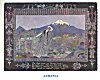
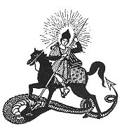

  
[Intangible Textual Heritage](../../index)  [Asia](../index.md) 
[Myths/Legends](../../neu/index)  [Index](index)  [Next](alp01.md) 

------------------------------------------------------------------------

*Armenian Legends and Poems* \[1916\] at Intangible Textual Heritage

------------------------------------------------------------------------

p. i

ARMENIAN

LEGENDS AND POEMS

p. ii

 

p. iii

[  
Click to enlarge](img/front.jpg.md)  
ARMENIA  

p. iv

# ARMENIAN

# LEGENDS AND POEMS

##### COMPILED & ILLUSTRATED

###### by

## ZABELLE C. BOYAJIAN

 

##### WITH AN INTRODUCTION BY THE RIGHT HON. VISCOUNT BRYCE, O.M.

#### LONDON: J. M. DENT & SONS LTD

#### NEW YORK: COLUMBIA UNIVERSITY PRESS

\[1916\]

NOTICE OF ATTRIBUTION.  
Scanned at Intangible Textual Heritage, June 2006. Proofed and Formatted
by John Bruno Hare. This text is in the public domain in the United
States because it was published prior to January 1st, 1923. These files
may be used for any non-commercial purpose, provided this notice of
attribution is left intact in all copies.

p. v

Dedicated

TO

THE UNDYING SPIRIT OF ARMENIA

p. vi

 

 

 

------------------------------------------------------------------------

[Next: Preface](alp01.md)
