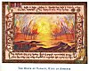

  
[Intangible Textual Heritage](../../index)  [Asia](../index) 
[Myths/Legends](../../neu/index)  [Index](index)  [Previous](alp13) 
[Next](alp15) 

------------------------------------------------------------------------

*Armenian Legends and Poems* \[1916\] at Intangible Textual Heritage

------------------------------------------------------------------------

p. 10

[  
Click to enlarge](img/01000.jpg)  
THE BIRTH OF VAHAGN, KING OF ARMENIA  

### VAHAGN, KING OF ARMENIA

##### From the History of Armenia,

###### by

##### MOSES OF KHORENE

(*Fifth Century*)

CONCERNING the birth of this king the legends say--

"Heaven and earth were in travail,  
And the crimson waters were in travail.  
And in the water, the crimson reed  
Was also in travail.  
From the mouth of the reed issued smoke,  
From the mouth of the reed issued flame.  
And out of the flame sprang the young child.  
His hair was of fire, a beard had he of flame,  
And his eyes were suns."

With our own ears did we hear these words sung to the accompaniment of
the harp. They sing, moreover, that he did fight with the dragons, and
overcame them; and some say that his valiant deeds were like unto those
of Hercules. Others declare that he was a god, and that a great image of
him stood in the land of Georgia, where it was worshipped with
sacrifices.

 

------------------------------------------------------------------------

[Next: Huntsman, That on the Hills Above](alp15)
