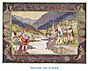
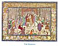

  
[Intangible Textual Heritage](../../index)  [Asia](../index.md) 
[Myths/Legends](../../neu/index)  [Index](index)  [Previous](alp39.md) 
[Next](alp41.md) 

------------------------------------------------------------------------

*Armenian Legends and Poems* \[1916\] at Intangible Textual Heritage

------------------------------------------------------------------------

p. 48

[  
Click to enlarge](img/04800.jpg.md)  
ARTASHES AND SATENIK  

### ARTASHES AND SATENIK

##### From the History of Armenia,

###### by

##### MOSES OF KHORENE

AT this time the Alans united with all the people of the mountain
country, and having taken possession of the half of Georgia, spread
themselves in great multitudes over our land. And Artashes collected a
mighty host together, and there was war between the two great nations.
The Alans retreated somewhat, and crossing over the river Kur they
encamped on its northern bank. And when Artashes arrived, he encamped on
the southern hank, so that the river was between them. But because the
son of the King of the Alans was taken captive by the Armenian hosts and
brought to Artashes, the King of the Alans sought peace, promising to
give to Artashes whatsoever he should ask. And he swore an eternal peace
unto him, so that the sons of the Alans might not be carried away
captive into the land of the Armenians. And when Artashes would not
consent to give back the youth, his sister came to the river's bank and
stood upon a great rock. And by means of the interpreters she spoke to
the camp of Artashes, saying:--"O brave Artashes, who hast vanquished
the great nation of the Alans, unto thee I speak. Come, hearken unto the
bright-eyed daughter of the Alan King, and give back the youth. For it
is not the way of heroes to destroy life at the root, nor for the sake
of humbling and enslaving a hostage to establish everlasting enmity
between two great nations." And on hearing such wise sayings, Artashes
went to the bank of the river. And seeing that the maiden was beautiful,
and having heard these words of wisdom from her, he desired her. And
calling Smpad his chamberlain he told him the wishes of his heart, and
commanded that he should obtain the maiden for him, swearing unto the
great Alan nation oaths of peace, and promising to send the youth back
in safety. And this appeared wise in the eyes of Smpad, and he sent
messengers unto the King of the Alans asking him to give the lady
Satenik his daughter as wife unto Artashes. And the King of the Mans
answered, "From whence shall brave Artashes give thousands upon
thousands and tens of thousands upon tens of thousands unto the Alans in
return for the maiden?"

p. 49

[  
Click to enlarge](img/04900.jpg.md)  
The Wedding  

Concerning this the poets of that land sing in their songs:--

"Brave King Artashes  
Mounted his fine black charger,  
And took the red leathern cord  
With the golden ring.  
Like a swift-winged eagle  
He passed over the river,  
And cast the golden ring  
Round the waist of the Alan Princess;  
Causing much pain  
To the tender maiden  
As he bore her swiftly  
Back to his camp."

Which being interpreted meaneth that he was commanded to give much gold,
leather, and crimson dye in exchange for the maiden. So also they sing
of the wedding:--

"It rained showers of gold when Artashes became a bridegroom.  
It rained pearls when Satenik became a bride."

For it was the custom of our kings to scatter coins amongst the people
when they arrived at the doors of the temple for their wedding, as also
for the queens to scatter pearls in their bridechamber.

------------------------------------------------------------------------

[Next: My Death](alp41.md)
