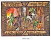

  
[Intangible Textual Heritage](../../index)  [Asia](../index.md) 
[Myths/Legends](../../neu/index)  [Index](index)  [Previous](alp48.md) 
[Next](alp50.md) 

------------------------------------------------------------------------

*Armenian Legends and Poems* \[1916\] at Intangible Textual Heritage

------------------------------------------------------------------------

p. 65

[  
Click to enlarge](img/06500.jpg.md)  
ARTAVASD  

### ARTAVASD

##### From the History of Armenia,

###### by

##### MOSES OF KHORENE

AFTER the death of Artashes his son Artavasd reigned, and he drove all
his brothers and sisters to the lands of Aghyovd and Arberan, that they
might not live in Aïrarat, on the territory of the King. And when he had
reigned but a little while, as he was riding over the bridge of Artashat
to hunt deer and wild asses on the banks of the Ghin, he was seized by
some visionary terror and lost his reason. And urging his horse down a
steep bank he fell into a chasm, wherein he sank and disappeared.

The singers of Ghogtan tell concerning him, that when his father was
dying many people killed themselves according to the customs of the
heathen; and they say that Artavasd was wroth, and said unto his father:

"Now that thou art gone  
And hast taken with thee the whole land,  
How shall I reign over the ruins?"

\[paragraph continues\] Therefore Artashes
cursed him, and said:

"When thou ridest forth to hunt  
Over the free heights of Ararat,  
The Strong Ones shall have thee,  
And shall take thee up  
On to the free heights of Ararat.  
There shalt thou abide,  
And never more see the light."

Old women also tell of him how that he is confined in a cavern and bound
with iron chains. And his two dogs do daily try to gnaw through the
chains to set him free, that he

p. 66

may come and put an end to the world; but at the sound of the hammers
striking on the anvil, the chains are strengthened. So also even in our
own times many blacksmiths do keep up the tradition and strike the anvil
three or four times on a Monday, to strengthen, as they say, the chains
of Artavasd. But the truth concerning him is as we have declared above.

Others say that at his birth the women of the house of Ahasuerus did try
to bewitch him, and therefore Artashes tormented them much; and these
same singers say also that the Children of the Dragons stole the infant
Artavasd and put a devil in his place. But unto us it seemeth that being
full of wickedness from his very birth, so also did he end.

 

------------------------------------------------------------------------

[Next: Charm Verses](alp50.md)
