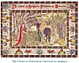

  
[Intangible Textual Heritage](../../index)  [Asia](../index.md) 
[Myths/Legends](../../neu/index)  [Index](index)  [Previous](alp64.md) 
[Next](alp66.md) 

------------------------------------------------------------------------

*Armenian Legends and Poems* \[1916\] at Intangible Textual Heritage

------------------------------------------------------------------------

p. 91

[  
Click to enlarge](img/09100.jpg.md)  
THE VISION OF ROSIPHELEE, PRINCESS OF ARMENIA  

### THE TALE OF ROSIPHELEE

##### From the "Confessio Amantis" by

### JOHN GOWER

(Died 1408)

  OF Armenye, I rede þus,  
Ther was a king, which Herupus  
Was hote, and he a lusti Maide  
To dowhter hadde, and as men saide  
Hire name was Rosiphelee;  
Which þo was of gret renomee,  
ffor sche was boþe wys and fair,  
And scholde ben hire fader hair.  
Bot sche hadde o defalte of Slowþe  
Towardes loue, and þat was rowþe;  
ffor so wel cowde noman seie,  
Which mihte sette hire in þe weie  
Of loues occupacion  
Thurgh non ymaginacion;  
That scole wolde sche noght knowe.  
And þus sche was on of þe slowe  
As of such hertes besinesse,  
Til whanne Venus þe goddesse,  
Which loues court haþ forto reule,  
Haþ broght hire into betre reule,  
fforþ wiþ Cupide and wiþ his miht:  
ffor þei merueille how such a wiht,  
Which þo was in hir lusti age,  
Desireþ nother Mariage  
Ne 3it þe loue of paramours,  
Which euere haþ be þe comvn cours

p. 92

Amonges hem þat lusti were.  
So was it schewed after þere:  
ffor he þat hihe hertes loweþ  
Wiþ fyri Dartes whiche he þroweþ,  
Cupide, which of loue is godd,  
In chastisinge haþ mad a rodd  
To dryue awei hir wantounesse;  
So þat wiþinne a while, I gesse,  
Sche hadde on such a chance sporned,  
That al hire mod was ouertorned,  
Which ferst sche hadde of slow manere:  
ffor þus it fell, as þou schalt hiere.  
Whan come was þe Monþe of Maii,  
Sche wolde walke vpon a dai,  
And þat was er þe Sonne Ariste;  
Of wommen bot a fewe it wiste,  
And fore sche wente priuely  
Vnto þe Park was faste by,  
Al softe walkende on þe gras,  
Til sche cam þer þe Launde was,  
Thurgh which þer ran a gret riuere.  
It þoghte hir fair, and seide, Here  
I wole abide vnder þe schawe:  
And bad hire wommen to wiþdrawe,  
And þer sche stod al one stille,  
To þenke what was in hir wille.  
Sche sih þe swote floures springe,  
Sche herde glade foules singe,  
Sche sih þe bestes in her kinde,  
The buck, þe do, þe hert, þe hinde,  
The madle go wir þe femele;  
And so began þer a querele  
Betwen loue and hir oghne herte,  
ffro which sche couþe noght asterte.

p. 93

And as sche caste hire yhe aboute,  
Sche syh clad in o suite a route  
Of ladis, wher þei comen ryde  
Along vnder þe wodes syde.  
On faire amblende hors þei sete,  
That were al whyte, fatte and grete,  
And euerichon þei ride on side:  
The Sadles were of such a Pride,  
Wiþ Perle and gold so wel begon,  
So riche syh sche neuere non:  
In kertles and in Copes riche  
Thei weren cloþed, alle liche,  
Departed euene of whyt and blew;  
Wiþ alle lustes þat sche knew  
Thei were enbrouded oueral.  
Here bodies weren long and smal,  
The beaute faye vpon her face  
Non erþly þing it may desface;  
Corones on here hed þei beere,  
As ech of hem a qweene weere,  
That al þe gold of Cresus halle  
The leste coronal of alle  
Ne mihte haue boght after þe worþ:  
Thus come þei ridende forþ.  
  The kinges dowhter, which þis syh,  
ffor pure abaissht drowh hire adryh  
And hield hire clos vnder þe bowh,  
And let hem passen stille ynowh;  
ffor as hire þoghte in hire avis,  
To hem þat were of such a pris  
Sche was noght worþi axen þere,  
ffro when þei come or what þei were.  
Bot leuere þan þis worldes good  
Sche wolde haue wist hou þat it stod,

p. 94

And putte hire hed alitel oute;  
And as sche lokede hire aboute,  
Sche syh comende vnder þe linde  
A womman vp an hors behinde.  
The hors on which sehe rod was blak,  
Al lene and galled on þe back,  
And haltede, as he were encluyed,  
Wherof þe womman was annvied;  
Thus was þe hors in sori plit,  
Bot for al þat a sterre whit  
Amiddes in þe front he hadde.  
Hir Sadel ek was wonder badde,  
In which þe wofull womman sat,  
And natheles þer was wiþ þat  
A riche bridel for þe nones  
Of gold and preciouse Stones.  
Hire cote was somdiel totore;  
Aboute hir middel twenty score  
Of horse haltres and wel mo  
Ther hyngen ate time þo.  
  Thus whan sche cam þe ladi nyh,  
Than tok sche betre hiede and syh  
This womman fair was of visage,  
ffreyssh, lusti, 3ong and of tendre age;  
And so þis ladi, þer sche stod,  
Beþoghte hire wel and vnderstod  
That þis, which com ridende þo,  
Tidinges couþe telle of þo,  
Which as sche sih tofore ryde,  
And putte hir fore and preide abide,  
And seide, Ha, Suster, let me hiere,  
What ben þei, þat now riden hiere,  
And ben so richeliche arraied?  
  This womman, which com so esmaied,

p. 95

Ansuerde wiþ ful softe speche,  
And seiþ, Ma Dame, I schal 3ou teche.  
These ar of þo þat whilom were  
Seruantz to loue, and trowþe beere,  
Ther as þei hadde here herte set.  
ffare wel, for I mai noght be let:  
Ma Dame, I go to mi seruise,  
So moste I haste in alle wise;  
fforþi, ma Dame, 3if me leue,  
I mai noght longe wiþ 3ou leue.  
  Ha, goode Soster, 3it I preie,  
Tell me whi 3e ben so beseie,  
And wiþ þese haltres þus begon.  
  Ma Dame, whilom I was on  
That to mi fader hadde a king;  
Bot I was slow, and for no þing  
Me liste noght to loue obeie,  
And þat I now ful sore abeie.  
ffor I whilom no loue hadde,  
Min hors is now so fieble and badde,  
And al totore is myn arai;  
And euery 3eer þis freisshe Mali  
These lusti ladis ryde aboute,  
And I mot nedes suie here route  
In þis manere as 3e now se,  
And trusse here haltres fore wiþ me,  
And am bot as here horse knaue.  
Non oþer office I ne haue,  
Hem þenkþ I am worþi nomore,  
ffor I was slow in loues lore,  
Whan I was able forto lere,  
And wolde noght þe tales hiere  
Of hem þat covþen loue teche.  
  Now tell me þanne, I 3ov beseche,

p. 96

Wherof þat riche bridel serueþ.  
Wiþ þat hire chere awei sche swerueþ,  
And gan to wepe, and þus sche tolde:  
This bridel, which 3e nov beholde  
So riche vpon myn horse hed,--  
Ma Dame, afore, er I was ded,  
Whan I was in mi lusti lif,  
Ther fel into myn herte a strif  
Of loue, which me overcom,  
So þat þerafter hiede I nom,  
And þoghte I wolde loue a kniht:  
That laste wel a fourtenyht,  
ffor it no lengere mihte laste,  
So nyh my lif was ate laste.  
Bot now, allas, to late war  
That I ne hadde him loued ar:  
ffor deþ cam so in haste bime,  
Er I þerto hadde eny time,  
That it ne mihte ben achieued.  
Bot for al þat I am relieued,  
Of þat mi will was good þerto,  
That loue soffreþ it be so  
That I schal swiche a bridel were.  
Now haue 3e herd al myn ansuere:  
To godd, ma Dame, I 3ou betake,  
And warneþ alle for mi sake,  
Of loue þat þei ben noght ydel,  
And bidd hem þenke vpon mi brydel.  
And wiþ þat word al sodeinly  
Sche passeþ, as it were a Sky,  
Al clene out of þis ladi sihte.  
And þo for fere hire herte afflihte,  
And seide to hirself, Helas!  
I am riht in þe same cas:

p. 97

Bot if I hue after þis day,  
I schal amende it, if I may.  
And þus homward þis lady wente,  
And changede al hire ferste entente,  
Wiþinne hire herte and gan to swere  
That sche none haltres wolde bere.

 

------------------------------------------------------------------------

[Next: The Song of the Vulture](alp66.md)
