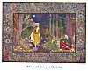

  
[Intangible Textual Heritage](../../index)  [Asia](../index) 
[Myths/Legends](../../neu/index)  [Index](index)  [Previous](alp67) 
[Next](alp69) 

------------------------------------------------------------------------

*Armenian Legends and Poems* \[1916\] at Intangible Textual Heritage

------------------------------------------------------------------------

p. 103

[  
Click to enlarge](img/10300.jpg)  
THE LADY AND THE MINSTREL  

### BALLAD

##### BY RAFFI

DARK forests clothe the mountain-side,  
     And o’er that mountain's lofty head  
The heavens bend their arches wide,  
     And, dome-like, round its summit spread.

A castle stood upon the steep,  
     Enchanted by a witch's spell;  
A maiden wept within the keep,  
     Bound by the chains of slav’ry fell.

Alone and sad, the maiden fair  
     Sat in her dark and narrow room.  
No hope had she, but dire despair  
     Had worn her heart with thoughts of gloom.

A minstrel passed--as it befell  
     A singer, singing sweetest strains;  
He broke the witch's evil spell,  
     And loosed the gentle maiden's chains.

She ran to him and kissed his face,  
     And said, "How I have longed for thee!  
God, in His mercy and His grace,  
     Hath sent thee here to set me free!"

p. 104

And when, above the mountain steep,  
     The moon shone out her silver light,  
And when the stars began to peep,  
     Twinkling and scatt’ring jewels bright,

The minstrel's love stole out unseen,  
     With burning thoughts of her belov’d;  
All through the woods so dark and green,  
     Seeking, and seeking him, she roved.

A hut there was within that wood,  
     Meet dwelling for some dervish old;  
All lined with moss and leaves, it stood  
     Protected from the rain and cold.

The minstrel lived within this nook,  
     And sang alone beneath the trees.  
His friend--Firdausi's wondrous book,  
     His comrades--Sadi and Hafiz.

The Houri of the castle there  
     Spent many happy days and nights--  
Immortal souls in Jennet [1](#fn_13) fair  
     Have never tasted such delights.

He wiped the tears by sorrow shed,  
     And healed the wounds by sorrow wrought;  
Like captive from a prison fled,  
     Her cares and woes she soon forgot.

Broken and aged was her sire;  
     A mighty Prince, the castle's lord,  
To satisfy his heart's desire,  
     Had reft her from him with his sword.

p. 105

The Prince held office high at court,  
And countless women, bright as day,  
Lived in his harem's vile resort,  
And slaves, more than my tongue can say.

His women, guarded day and night,  
Caged in with iron bars he keeps;  
But LOVE, more strong than despot's might,  
Breaks through that cage, those bars o’erleaps.

------------------------------------------------------------------------

### Footnotes

[104:1](alp68.htm#fr_13) The Paradise of
Mohammed, where the souls of the blest are waited upon by beautiful
houris, and fed with delicious fruits.

------------------------------------------------------------------------

[Next: No Bird Can Reach the Mountain's Crest](alp69)
